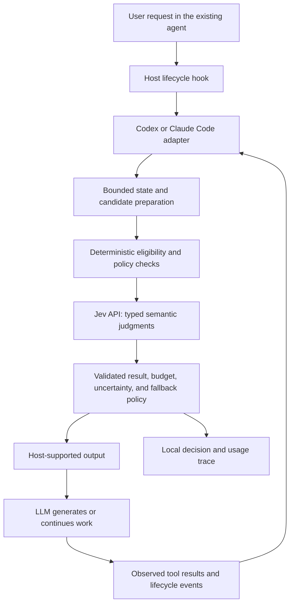

# Jevra: Product and Technical Specification

Status: proposed, before implementation

Specification version: 0.1

Created: 2026-09-17

Repository: https://github.com/dsandrade/jevra

## 1. Objective

Build an open-source decision layer that lets users continue using Codex or Claude Code normally while a local runtime delegates selected semantic judgments to TypeSafe's Jev API.

The initial objective is to explore the architecture and measure both task quality and efficiency. Neither a quality improvement nor a cost or latency reduction is assumed.

The product is installed as host-specific plugins. Its implementation has a reusable core that may later become a public framework once real integrations establish a useful API.

## 2. Product thesis

Coding agents mix generation, reasoning, selection, validation, retrieval, and execution. Some recurring choices have explicit candidates and can be evaluated separately from the LLM's generation work.

The proposed responsibility split is:

| Component | Responsibility |
| --- | --- |
| User | Supplies goals, constraints, preferences, and authorization |
| Host agent | Maintains the conversation, tool execution, native permissions, and sandbox |
| LLM | Generates text, code, and candidate solutions; handles open-ended reasoning |
| Jev | Evaluates narrow semantic questions against supplied state and criteria |
| Runtime | Collects state, applies deterministic rules, calls the provider, and maps judgments to behavior |

Jev is not an autonomous replacement for the host agent. It cannot select an option that the runtime did not supply. Typed answers ensure an interface, not factual correctness or authorization.

The runtime cannot observe or redirect every internal LLM decision. Injected advice also does not guarantee that the host model follows it. These limits must remain explicit in documentation and evaluations.

### Related work: Spotify Portal AI Plugins and shunt

The [Spotify repository](https://github.com/spotify/portal-ai-plugins) packages Portal workflows for existing coding agents. Its [shunt plugin](https://github.com/spotify/portal-ai-plugins/blob/3c24ca30ff63e1f5bbad1c43fe5324daff579123/plugins/shunt/README.md) is the closest reference: hooks redirect large reads, scripts call auxiliary models through Portal/AiKA, and skills describe when to delegate. The reviewed shunt implementation targets Claude Code and keeps architectural judgments with Claude.

Jevra shares the goal of distributing work while preserving the existing agent interface. Its first module delegates bounded semantic selection to Jev rather than moving bulk reading or text generation to another LLM. Shunt is an architectural reference, not a required dependency or a benchmark proving Jevra's value.

Reuse the separation between hooks, executable integration code, and skill guidance. Verify host behavior independently and retain a deterministic routing baseline. No Spotify source code is included in this initial repository.

The reviewed [benchmark definition](https://github.com/spotify/portal-ai-plugins/blob/3c24ca30ff63e1f5bbad1c43fe5324daff579123/plugins/shunt/evals/benchmarks.json) estimates Claude context tokens using characters divided by four. That measurement does not by itself establish total system cost, latency, or outcome quality. Jevra must include provider overhead and final task outcomes.

## 3. User experience

1. Install the plugin for a supported host and configure a user-owned TypeSafe API key.
2. Review and trust hooks through the host's supported mechanism where required.
3. Configure the permitted skill sources, decision modules, and operating mode.
4. Continue sending ordinary requests in the existing Codex or Claude Code interface.
5. Inspect a local report when interested in decisions, failures, quality, or overhead.
6. Disable or uninstall the plugin without removing unrelated user configuration.

No extra command or explicit mention should be required for decisions attached to supported lifecycle hooks. Diagnostics must make inactive or untrusted hooks visible. Normal successful operation should avoid repetitive chat messages.

Automatic activation does not authorize uploading arbitrary workspace contents. Setup must explain the bounded state sent to TypeSafe. Full transcripts and full repositories are not default inputs.

## 4. Scope

### Initial release: skill selection

- Shared decision core and Jev integration.
- A local command-line entry point for hook execution and diagnostics.
- Separate Codex and Claude Code plugins and adapters.
- A bounded skill catalog from explicitly configured or verified supported sources.
- Pre-response selection of at most one skill, including no applicable skill.
- Observe and advise modes, with native behavior as the fallback.
- Local operational traces, privacy controls, and usage accounting.
- Reproducible component and end-to-end evaluations.
- Installation, upgrade, disable, and uninstall documentation.

### Later experiments

- Selecting evidence through retrieval controlled by the runtime.
- Checking explicit completion requirements against observed evidence.
- An MCP tool for LLM-proposed candidates and explicit decision requests.
- A supported library API for other agent integrations.

### Non-goals for the initial release

- Replacing the Codex or Claude Code conversation loop.
- Intercepting hidden reasoning or claiming universal decision coverage.
- Building a new chat application or requiring users to switch agents.
- Authorizing privileged actions based on model confidence.
- Rewriting arbitrary tool arguments or routing every tool invocation.
- A hosted control plane, billing service, dashboard, or persistent daemon.
- Training, distributing, or self-hosting Jev model weights.

## 5. Architecture



### Proposed repository layout

This is a future layout, not a claim that these packages exist:

```text
packages/
  core/
  provider-typesafe/
  cli/
  adapter-codex/
  adapter-claude-code/
plugins/
  codex/
  claude-code/
evals/
  datasets/
  runners/
  reports/
```

Use TypeScript for the initial implementation. Select and pin a supported Node.js LTS version, package manager, SDK, and validation library during scaffolding. Keep host schemas out of the core.

A synchronous hook process is the starting execution model for decisions that must affect the current request. Process startup, API latency, and host delivery all count toward overhead. An asynchronous observer may be useful for shadow evaluation, but it cannot control an operation that has already proceeded.

Do not introduce a daemon until measurements show that its lifecycle complexity is justified.

## 6. Host capability model

Documentation was reviewed on 2026-09-17. The following are documented capabilities, not locally verified compatibility claims. Pin and test actual host versions before announcing support.

| Surface | Planned use | Boundary |
| --- | --- | --- |
| `SessionStart` | Optional initialization and diagnostics | Not sufficient for routing every request |
| `UserPromptSubmit` | Skill selection before generation | Context injection guides the model; it does not replace the native router |
| `PreToolUse` | Observe actual skill-loading behavior where identifiable | The LLM has already proposed a tool call; interception cannot undo that reasoning cost |
| `PostToolUse` | Record observed results and delivery outcomes | Cannot undo executed side effects |
| `Stop` | Later bounded completion checks | Continuation must have a strict retry limit |
| MCP tool | Later explicit evaluation or controlled retrieval | Invocation depends on the host model or a supported hook configuration |

Codex and Claude Code require independent schema and behavior mappings. Similar event names do not imply equivalent semantics. For example, the reviewed Codex documentation does not support `permissionDecision: "ask"` in `PreToolUse`, while Claude Code documents it.

The reviewed Codex documentation excludes hosted tools such as WebSearch from the local tool-hook path and describes other possible exceptions. The runtime must not present hooks as a complete enforcement boundary.

Codex plugin hooks require native trust review; installation alone does not activate them. The installer must not fabricate trust records or silently override native protections.

Each adapter needs an explicit capability table: supported host versions, event inputs, available outputs, context limits, trust requirements, and known coverage gaps. Unsupported behavior must degrade visibly through diagnostics and safely through the host's normal flow.

## 7. Decision contract

A decision module defines a stable identifier, schema version, required state, eligible events, candidate construction, questions, policy, and fallback. Do not ask Jev to decide which arbitrary questions the runtime should ask on every event.

Conceptual input fields:

| Field | Purpose |
| --- | --- |
| `decision_id` | Identifies the bounded decision being evaluated |
| `schema_version` | Pins the normalized input contract |
| `host` | Host name, version, and supported capabilities |
| `session_id`, `turn_id`, `event_id` | Isolate and correlate work; absent host IDs require documented adapter-generated IDs |
| `state_revision` | Prevent applying a result to changed state |
| `state` | Relevant request, evidence, and explicit constraints |
| `candidates` | Available options and their source identifiers |
| `question_version`, `policy_version` | Make evaluations and cache entries reproducible |
| `budget` | Time, call-count, and input-size limits |

The result separates raw provider judgments from the runtime's disposition:

- `judgments`: typed answers and available probability distributions.
- `disposition`: `recommend`, `abstain`, or `fallback` for the initial release.
- `selected_candidate_id`: present only for a validated recommendation.
- `reason_code`: a deterministic operational reason, not fabricated model reasoning.
- `usage`, `latency_ms`, and `provider_model`: provider and runtime accounting.
- `applied`: whether the adapter delivered supported output, distinct from whether the LLM followed it.

The provider's `confidence` must not be a mandatory universal field: Choice and Score expose it, while Noul returns a yes-probability. None of these values is a general probability that the workflow is correct.

## 8. Jev integration

The currently documented HTTP endpoint is `POST https://api.typesafe.ai/v1/systemone`, accepting `state`, `model`, and a map of typed `questions` and returning `answers`, `model`, and `usage`.

Use the official SDK if it fits the verified runtime requirements. Keep transport details behind a narrow provider boundary. Resolve a specific available model version for evaluations and record it; avoid comparing runs across an unrecorded moving alias.

Question design:

- Use Choice to select one of the supplied options.
- Use Noul for independent yes/no properties, such as whether a candidate actually covers the request.
- Use Score only for a defined ordered dimension.
- Include explicit no-match or abstention behavior.
- Ask independent questions over the same state together when beneficial.
- Use a subsequent call only when it needs earlier results or new evidence.
- Keep deterministic eligibility, exact matching, side effects, and policy in code.

Do not assume that batching eliminates the cost of extra questions. Measure total request size, billed usage, and end-to-end latency.

## 9. Initial module: skill selection

### Inputs

- The current request and the minimum bounded prior context needed to interpret it.
- Explicit user choices and relevant host instructions.
- An eligible skill catalog with stable IDs, descriptions, source paths, and content hashes.
- Optional excerpts from shortlisted skills when permitted by configured data scope.

Catalog discovery must use supported interfaces or explicit configured directories. Do not assume that host-internal registries are public APIs. Declare catalog coverage in diagnostics; an incomplete catalog must not be presented as exhaustive.

### Workflow

1. Apply deterministic eligibility and explicit user-selection rules.
2. If the user named a known skill, preserve that choice instead of semantically overriding it.
3. If routing is appropriate, rank the eligible candidates and check whether any fits.
4. Optionally inspect a small shortlist in a second call; benchmark this against a single call.
5. Apply evaluated thresholds and return a recommendation or abstention.
6. In observe mode, record the result without changing model-visible context.
7. In advise mode, inject a short host-supported recommendation identifying the skill and its source.
8. Observe later skill use where reliable evidence exists; otherwise mark adherence unknown.

The first module recommends at most one skill. Requests that require several skills or have unresolved ambiguity fall back to native behavior until explicitly supported.

The module does not remove the host's native skill catalog and therefore cannot assume savings from shrinking that catalog. It must not load all skill bodies into the LLM context to compensate for routing limitations.

The TypeSafe skill-suggestion cookbook is a reference experiment. Its published measurements concern a specific Hermes/Claude setup and are not results for this project.

## 10. Operating modes and failure behavior

| Mode | Behavior |
| --- | --- |
| Disabled | No provider evaluation or injected guidance |
| Observe | Evaluate and record; do not change the model-visible decision |
| Advise | Deliver a bounded recommendation, preserving native host control |

Enforced control is outside the initial release. A future module must document both the supported host mechanism and the authorization needed for each action.

For consultative routing, timeout, unavailable credentials, rate limiting, service failure, malformed output, missing candidates, low-confidence policy outcomes, or stale state return to native behavior. Record the failure category without leaking input or credentials.

Retries must fit a total wall-clock deadline and call budget. Do not inherit an SDK retry schedule that can exceed the hook deadline. Authentication and schema failures should not cause repeated calls within the same request.

Prevent recursive hooks, duplicate processing, cross-session contamination, and indefinite continuation. Any future completion hook must honor interruption and enforce an explicit maximum number of correction attempts.

Cache keys must include the relevant normalized state, catalog/content revisions, question version, policy version, and provider/model identity. Expired or changed state invalidates applicability. Measure cold and warm cache conditions separately.

## 11. Data and authority boundaries

- Credentials stay in local user configuration or an approved secret store and never enter prompts, logs, fixtures, Git, or reports.
- Send only the state needed for the enabled decision and disclose those fields during setup.
- Treat repository content, tool output, and skill text as potentially untrusted data. They cannot expand plugin authority or become executable hook commands.
- Preserve native permissions and user instructions. Semantic confidence does not grant authorization.
- Validate hook payloads and provider responses before using them.
- Keep operational logs local by default, with bounded retention and deletion support.
- Default traces store IDs, versions, hashes, reason codes, timing, and usage rather than raw prompts or source code.
- A reproducibility capture mode may retain reviewed, sanitized inputs with explicit opt-in. Metadata-only production traces are not sufficient to replay inference.
- Public datasets and reports must contain synthetic or explicitly approved material.

No external telemetry service is required for the first release.

## 12. Evaluation design

### Hypotheses

| ID | Hypothesis |
| --- | --- |
| H1 | Jev-assisted routing reduces wrong or unnecessary skill selections |
| H2 | Better routing improves end-to-end task success or reduces rework |
| H3 | Avoided work can offset Jev calls, hook startup, and added context |
| H4 | The integration preserves normal usability in both supported hosts |

### Comparison arms

1. The original agent with no plugin decision.
2. The same agent with a deterministic routing baseline and equivalent integration plumbing.
3. The same agent with Jev-assisted routing.
4. Optional diagnostic oracle: the same agent given a reviewed correct suggestion.

The oracle estimates a routing opportunity; it is not a deployable competitor. Observe mode estimates decision quality and overhead but cannot establish the effect of applied advice. Active end-to-end runs are necessary for that.

### Dataset and execution

Begin with a pilot of approximately 50-100 reviewable tasks, not a claim of sufficient statistical power. Include close-match skills, no-match requests, explicit skill choices, multi-skill requests, ambiguous requests, and representative coding tasks with independent checks.

Separate development/calibration cases from held-out evaluation cases. Record provenance and acceptable alternatives. Use repeated runs and paired tasks, with comparable clean workspace state, fixed host/model/settings, randomized run order where practical, and separate cache conditions.

Label routing independently of Jev. Measure final outcomes using tests, known expected behavior, or review with a rubric. Do not use Jev as the sole judge of its own success.

### Metrics

| Dimension | Metrics |
| --- | --- |
| Routing | Wrong selection, unnecessary selection, missed applicable skill, abstention |
| Delivery | Advice delivered, followed, ignored, contradicted, or unknown |
| Quality | Task success, regressions, incomplete requirements, human corrections |
| Work | Tool calls, skill loads, retries, repeated work |
| Latency | Total task duration and decision overhead, with p50 and p95 where sample size allows |
| Consumption | LLM and Jev input/output usage, cache usage where exposed, API request counts |
| Cost | Actual provider charges where available; separately labeled token-based estimates |
| Reliability | Timeouts, service failures, fallback rate, inactive hooks, isolation failures |

Subscription usage is not equivalent to marginal API billing. Never invent dollar savings from tokens alone or report unavailable usage as zero. Report sample size, variability, host/model versions, failures, and harms as well as improvements.

### Promotion gate

Advance a module when held-out evidence shows either improved quality within an explicitly agreed overhead budget, or lower cost/time with quality within a predefined acceptable margin. Fix numerical budgets and margins before the confirmatory evaluation; the pilot informs them.

If no benefit appears, publish the negative result and revise or retire the module. Do not expand the framework merely because the integration works technically.

## 13. Later modules

### Controlled context selection

Code retrieves a bounded set of candidate passages; Jev scores relevance against the request; code returns selected passages with source attribution through a runtime-owned tool, potentially MCP. The runtime cannot promise control over unrelated host retrieval or all context already loaded by the host.

Measure whether selection preserves required evidence and improves final answers after including retrieval, evaluation, and tool-invocation overhead.

### Completion checking

Evaluate explicit requirements individually against observed artifacts and execution evidence. A statement that tests passed is not a substitute for actual test output. Use deterministic checks where available; Jev may judge semantic coverage of evidence.

Only request a bounded, specific correction when supported by evidence. Missing evidence and uncertainty must not become assertions of failure or success. Stop-hook loops require a hard attempt limit.

### Explicit candidate evaluation

A future `decision.evaluate` MCP tool may accept candidate solutions proposed by the LLM. Clearly separate the cost of generating options from evaluating them, and include no-acceptable-option handling. This cannot guarantee automatic delegation of internal reasoning.

## 14. Open-source delivery

- MIT license for original repository code and documentation.
- Public repository under `dsandrade/jevra`.
- Local bring-your-own-key operation with a documented external TypeSafe dependency.
- Versioned plugin manifests and documented host compatibility.
- Reproducible sanitized datasets, evaluation runners, and reports.
- Straightforward contribution guidance and diagnostic bug-report templates.
- GitHub Git transport over SSH.

Initial publication contains planning documents only. Package publishing, marketplace submission, and public performance claims are separate later milestones.

## 15. Decisions to resolve during implementation

| Question | Resolution point |
| --- | --- |
| Which exact host versions and surfaces are supported? | DR-001 compatibility spike |
| Which catalog interfaces are reliable in each host? | DR-001 and DR-005 |
| Which Node.js LTS, package manager, and SDK versions are pinned? | DR-002 scaffolding |
| Single evaluation or shortlist plus verification? | DR-007 and DR-011 pilot |
| What thresholds, latency budgets, and quality margins apply? | DR-011 before held-out evaluation |
| Is native subscription usage sufficient for cost measurement? | DR-010 instrumentation |
| Does process startup justify a persistent service? | Only after DR-011 evidence |
| Is a general public framework API warranted? | DR-017 after multiple validated modules |

## 16. Sources

Primary sources reviewed on 2026-09-17. Recheck before implementation because host behavior and provider contracts may change.

- [Codex hooks](https://learn.chatgpt.com/docs/hooks)
- [Codex plugins](https://learn.chatgpt.com/docs/plugins)
- [Claude Code hooks](https://code.claude.com/docs/en/hooks)
- [TypeSafe documentation index](https://docs.typesafe.ai/llms.txt)
- [Building with System One](https://docs.typesafe.ai/concepts/how-to-build-with-system-one)
- [TypeSafe HTTP API](https://docs.typesafe.ai/api)
- [TypeSafe confidence](https://docs.typesafe.ai/confidence)
- [TypeSafe skill-suggestion experiment](https://docs.typesafe.ai/cookbooks/skill_suggestion)
- [TypeSafe function-calling cookbook](https://docs.typesafe.ai/cookbooks/function_calling)
- [Spotify shunt at the reviewed commit](https://github.com/spotify/portal-ai-plugins/tree/3c24ca30ff63e1f5bbad1c43fe5324daff579123/plugins/shunt)
