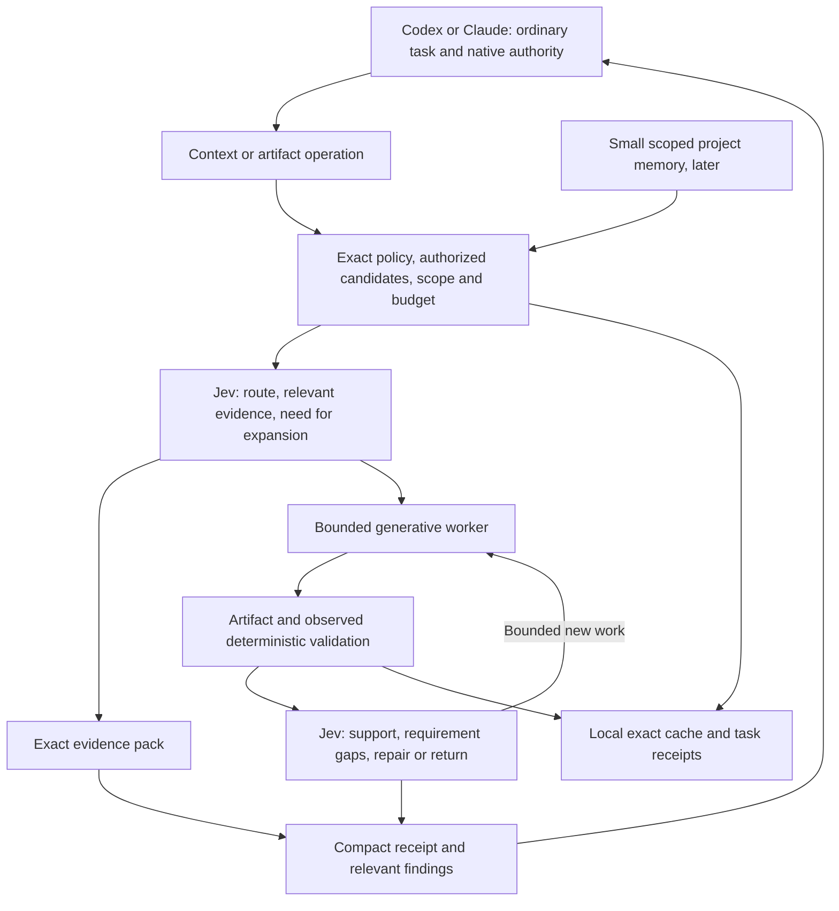

# Architecture critique: quality and cost first

> Subsequent decision: [CLI-first worker v1](v1-delivery-plan.md) adopts a bounded worker-first delivery. This review remains the historical rationale; the linked plan and current SPEC/ISSUES govern implementation order.

> The [2026-09-18 comparison](shunt-architecture-review-2026-09-18.md) reviews the implemented compact path and subsequent diagnostics. Its recommendations were subsequently adopted in [the correction contracts](focused-reader.md); statements about missing generation in this older review describe its earlier source snapshot.

Date: 2026-09-17. Status: recommendation for discussion; no runtime changes or new benchmark results. Reviewed public design at `482a26a` and executable implementation at `438bd85`. This review recommends a smaller delivery sequence; it does not declare the recommendations adopted or implemented.

## Verdict

The architecture has sound boundaries but its delivery plan is overextended for the immediate objective. It puts a broad memory and engineering workflow ahead of demonstrating economical delegation. Build the smallest complete path that produces correct code at lower total cost, with Jev owning every explicit semantic decision inside that path. Expand the development brain when measured reuse justifies it.

Preserve TypeScript/Node, both native hosts, scoped MCP, source provenance, native permissions and independent verification. Preserve the long-term memory direction. Change the order and the amount of work on the default path. A twelve-stage decision inventory is useful coverage documentation; it should not become twelve mandatory stages for a small task.

## What the evidence actually says

The reviewed [shunt reader](https://github.com/spotify/portal-ai-plugins/blob/3c24ca30ff63e1f5bbad1c43fe5324daff579123/plugins/shunt/scripts/bulk-read) sends sources to a generative worker and returns an answer. Its [writer](https://github.com/spotify/portal-ai-plugins/blob/3c24ca30ff63e1f5bbad1c43fe5324daff579123/plugins/shunt/scripts/code-write) can write generated code to a target and return a small receipt. The [benchmark definition](https://github.com/spotify/portal-ai-plugins/blob/3c24ca30ff63e1f5bbad1c43fe5324daff579123/plugins/shunt/evals/benchmarks.json) measures estimated main-agent context, using characters divided by four. It does not establish a matching reduction in total provider cost or independently validated task success.

The [Spotify article](https://portal.spotify.com/blog/portal-by-spotify-cut-my-claude-code-token-usage-by-90) also reports limitations for debugging, architecture and precise edits. Its local helper flow does not establish that persistent project memory is required for those savings. Recreating an entire platform is therefore not a prerequisite to test the two relevant mechanisms.

Jevra's [pilot](../evals/reports/2026-09-17-full-task-pilot.md) completed twelve runs across only two distinct synthetic tasks. Codex's matched API-equivalent cost estimate increased by about 5.5–6.5%; Claude's decreased by about 6%, with successful Jev helper use in only one of its two Jev-arm tasks. The pilot proves useful integration facts, not general savings. It has no auxiliary generation or durable memory arm.

The host cost dominates that pilot. Consequently, optimizing Jev's already small observed cost is less urgent than preventing additional host turns, rereads and expensive generation. This is a prioritization inference from the pilot, not a proven causal explanation for every run.

## Principal architectural criticisms

### 1. Delegated generation is too late in the plan

In the current code, [both MCP tools](../packages/cli/src/mcp.ts) retrieve evidence; the principal model still generates the code. Jev cannot replace a generative worker as a drop-in client. If the principal emits the same long artifact after a selection call, its output cost remains and orchestration adds cost.

Promote a bounded worker provider, focused answers and predictable artifact generation before automatic documentation, general lessons or a complete investigation engine. An inexpensive generative worker should be an available product capability; invoking it on every task should not be mandatory. Users can retain evidence-only operation, with narrower savings expectations.

Start generation with tests, fixtures, configuration and well-specified repetitive code. Keep open-ended architecture, concurrency bugs and poorly specified cross-cutting changes outside the first delegated generation domain. Extending Jev-managed planning into those domains requires its own evidence, not confidence in the product thesis alone.

### 2. Absolute decision independence conflicts with the host model

Codex and Claude already choose tools and generate candidate solutions before a hook or helper can evaluate them. Generated code and candidate plans also contain implicit choices. A plugin cannot promise that all those choices move to Jev while leaving the native host loop unchanged.

The enforceable contract is: every explicit semantic choice inside a Jevra-owned operation uses Jev; code owns exact policy and execution. The LLM proposes and synthesizes. Host actions outside that operation are native, observable only where supported. Total ownership of the conversation loop would require a separate controlled runner or substantially deeper host integration; exclude that from this plugin's initial scope.

Being designed for decisions does not establish Jev's superiority on subtle code reasoning. Test whether it selects suitable routes, complete evidence and supported findings on held-out coding cases. Its [typed composition model](https://docs.typesafe.ai/concepts/how-to-build-with-system-one) supports this architecture; it is not proof of final code correctness.

### 3. Candidate generation can erase the benefit of cheap selection

Asking a frontier LLM to produce several full plans or patches before Jev chooses one may cost more than directly solving the task. Jev also cannot select an alternative that the candidate generator omitted.

Use configured execution modes and retrieved source candidates where possible. Generate one bounded artifact first; request another candidate or additional investigation only when Jev evaluates the supplied evidence as insufficient or unsuitable, under a finite budget. Do not confuse a single-candidate acceptance question with proof that the best possible solution was found. Compare candidate recall and selection quality separately.

### 4. Evidence completeness matters more than a small response

The current [selector](../packages/core/src/context.ts) chunks by lines/byte caps, shortlists lexically, scores passages independently and applies a top-K/output cap. It is useful groundwork, but ranking passages separately does not ensure the selected set contains all required definitions, exceptions and cross-file constraints. Several high-scoring passages may repeat the same fact.

Construct candidates from lexical search plus supported symbol/reference relationships and exact references. Have Jev evaluate requirement relevance/support and missing evidence over bounded state. Assemble the set with deterministic budgets and versioned policy, preserving critical counterexamples and neighboring definitions. Return explicit gaps and progressive source handles. Do not claim coverage of unseen files. Add embeddings only if measured candidate recall warrants their cost.

### 5. Returning every intermediate result recreates expensive orchestration

An extra host round trip can dominate the cost of several small Jev judgments. Avoid a pattern where the host calls separate tools to retrieve, rank, route, summarize, judge and remember, restating the task each time.

Implement those dependent operations within a bounded runtime helper. Batch independent Jev questions over useful shared state; dependent questions still require later calls. Return a compact evidence result or artifact receipt and only the findings needing host attention. A valid receipt must be enforced for managed actions but need not be narrated in full to the host.

Target two main capabilities: context and artifact generation. Keep exact tool names/backward compatibility a packaging decision. Do not expand the default tool catalog into one tool per primitive or lifecycle stage. Do not assume a smaller catalog automatically improves tool adoption; measure ordinary sessions.

### 6. Quality controls need different roles

Deterministic checks establish observed facts: schema validity, source freshness, compilation and actual test outcomes. Jev evaluates semantic support, applicability and bounded requirement coverage. A separate generative reviewer can produce candidate findings when applicable; it is not a mandatory second full pass on every low-risk artifact unless project policy requires it.

Jev should not certify a patch merely because the generator explains it convincingly. Include the relevant actual diff/source and test evidence, not just a self-authored summary. A lack of evidence stays unresolved. The [confidence contract](https://docs.typesafe.ai/confidence) does not establish correctness; thresholds need evaluation in this domain. Keep benchmark checks and reviewers independent of the generator and Jev.

For visual tasks, [Jev currently accepts text state](https://docs.typesafe.ai/concepts/state), not screenshots. DOM/accessibility observations and test output can be evidence, but purely visual defects require an appropriate observation source or reviewer. Do not claim that text-only Jev judgments replace direct visual validation.

### 7. Mandatory decision ownership increases availability pressure

Retain explicit `unavailable`, `abstained` and `native_bypass` outcomes. Do not silently switch a managed semantic decision to an LLM. Minimize unnecessary serial decisions and preserve checkpoints so an unavailable service does not discard completed work. A native continuation remains possible outside the managed workflow and must count as such.

Report decision accuracy, adoption, cost and availability together. One hundred percent Jev receipt coverage with poor candidate coverage or frequent bypass is not a successful product.

## A smaller development brain

The existing three-way separation is sound: derived repository knowledge, durable engineering memory and temporary task state. A local embedded store is a reasonable initial direction. A vector database, hosted service or knowledge graph does not by itself make it a better brain.

| Layer | Minimum useful form | Defer |
| --- | --- | --- |
| Current repository evidence | On-demand files/symbols, hashes, supported reference edges, exact span cache | LLM-generated documentation for every module; a universal cross-repository graph |
| Task state and receipts | Goal, authorized scope, current requirements, attempted operations, evidence handles, validation and budget | Full transcripts, hidden reasoning, a general workflow language |
| Durable project memory | Explicit accepted constraints, concise validated outcomes and failed attempts with applicability/source bindings | Autonomous global lessons, semantic merges, unsolicited consolidation and broad external connectors |

Treat current code, accepted constraints and observed checks according to their role. A stored architectural constraint can remain normative after a code change; mark its applicability for revalidation, rather than deleting it as if it were a cached source excerpt. Derived statements about deleted code should invalidate immediately. These record types need different freshness policies.

A local SQLite/FTS5 implementation remains a candidate, subject to binding/packaging/concurrency verification. The decisive design choices are source binding, selective retrieval, correction and useful reuse. Start with exact caches and compact task receipts, then a small explicit-memory slice. They can share storage infrastructure without sharing lifecycle semantics. Do not block the first worker experiment on a complete memory subsystem.

Memory has an economic test: avoided rediscovery and repair over subsequent tasks must exceed ingestion, update, retrieval and stale-context costs. Measure first-use and repeated-project results separately. Automatic knowledge compilation is worthwhile only after that evidence exists for a defined workload.

## Keep, narrow, defer or exclude

| Capability | Recommendation | Reason |
| --- | --- | --- |
| Native plugin activation and telemetry | First | No adopted helper or attributable usage means no trustworthy savings result |
| Jev decision kernel and bounded receipts | First, minimal | Enforce the product differentiator without building a general orchestration framework |
| Structural candidates, progressive reads and exact cache | First | Direct opportunity to avoid duplicate context while preserving edit evidence |
| Focused worker answers and staged artifacts | First economic vertical slice | Test expensive input/output substitution, including review and repair costs |
| Actual behavioral checks and bounded repair | Include in every applicable slice | Correctness must survive delegation; mandatory project checks always apply |
| Explicit project memory | Small follow-on slice | Useful continuity without precomputing a repository encyclopedia |
| Project profiles and impact checks | Minimal and task-specific | Read actual build/test conventions; expand cross-component coverage when needed |
| Assumption ledger | Compact and exceptional | Preserve consequential unresolved choices; do not turn trivial work into a plan-writing exercise |
| Independent generative review | Conditional, measured | Potential quality value with additional context, latency and generation cost |
| Automatic knowledge/lesson generation | Defer | Reuse and error-prevention benefits have not yet paid for ingestion/maintenance |
| Universal twelve-stage workflow or global semantic planner | Exclude from initial release | Duplicates the host loop and multiplies failure and cost surfaces |
| Framework API, remote brain and organization connectors | Defer | Not required for a correct cheaper coding task |
| Skill routing | Preserve existing experiment, deprioritize expansion | Does not remove the host catalog or directly avoid long artifact generation |

## Recommended operating flow

This is a partial information-flow diagram. Route/relevance can share a request only when the questions are independent against the same available state. Source expansion requires a new state. Execution and artifact application remain authorized host operations with preimage checks; an MCP process is not an exemption from host authority. Difficult unsupported operations stay native and outside claims of managed decision coverage.

## Recommended delivery order

Use existing backlog IDs. These are recommended slices, not claims of completion or newly created GitHub issues.

| Order | Deliverable and existing issues | Required exit evidence |
| --- | --- | --- |
| 0 | DR-018/020 and minimal DR-034: ordinary adoption, ledger, bounded Jev contracts | Attributable complete-task path in each host; receipts, failures and bypass visible |
| 1 | DR-021/024 with the relevant DR-009 limits: evidence and reuse | Better required-evidence recall or lower complete-task cost, including rereads; edits invalidate exact cache |
| 2 | DR-022/023/025: minimal worker provider, one answer mode and one artifact mode | Correct staged artifact, actual validation, Jev decisions, bounded repair and full cost; no complete brain prerequisite |
| 3 | DR-019/027: native/retrieval/worker/Jev matched comparison | Independent tasks establish where delegation pays and where it must abstain |
| 4 | Small DR-028/029/030 slice, using measured retrieval needs | Cross-host reuse beats rediscovery after counting ingestion and stale-memory errors |
| 5 | Selected DR-031/032/033/035–038 extensions | Each addition improves a declared quality/cost objective on its own workload |

Revise dependencies when this order is adopted: the minimum DR-025 route contract belongs alongside DR-034 before the first worker runs; it must not wait for a finished worker product. DR-023 needs the shared worker provider, not completion of all bulk-reader experiments. Split lightweight structural retrieval from a full DR-031 index. Preserve issue IDs and historical results.

## Evaluation and stopping rules

Primary metric: `sum(cost of all attempted runs) / independently accepted tasks`, under a predeclared quality floor. Also report host input/cache/output, all-provider usage, latency, human correction, first-pass success and plugin adoption. Zero accepted tasks is failure, not zero cost. API-equivalent dollars and subscription consumption are different measures; unavailable subscription usage stays unknown.

Use native host; deterministic retrieval/cache; the same bounded worker with fixed/deterministic experimental routing; and the same worker plus Jev. Add a Jev-only evidence arm if needed to separate reranking from generation. Keep models, candidate sources, scopes and budgets matched where possible. Candidate selection and routing are separate Jev factors: isolate them before attributing all gains to either. Memory is a later cold/warm ablation. An actual Spotify comparison still requires authenticated AiKA; otherwise name the control a reproduction.

Include broad understanding, exact edits, predictable output-heavy generation, multi-file defects, conflicting/missing evidence and tasks where delegation should decline. Tests generated by the worker do not establish their own adequacy: use held-out acceptance checks and, for test-generation tasks, known faults or mutation checks. Freeze pass criteria before runs, rotate order, report cache classes, and retain failed/interrupted spend.

Instrument selection, helper adoption, subsequent rereads, expanded evidence, generated artifact tokens and repair cost. Test the hypothesis that eliminating host round trips matters more than shrinking the helper response alone. Preserve provider prompt-cache behavior where supported; application cache and provider cache are different, and changing injected context can affect the latter.

Stop expanding the default pipeline when a component adds cost without sufficient quality benefit. Reduce serial questions, candidate-generation work or mandatory review before adding more models. Do not remove Jev ownership from a managed semantic decision to disguise an unsuccessful experiment; narrow that operation's scope or defer its release. The architectural recommendation is testable, not a guarantee of matching or exceeding a published percentage.
