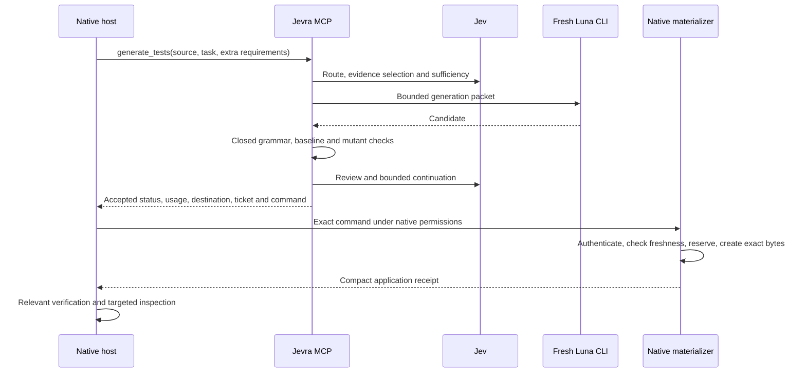

# Compact artifact delivery

Status: experimental implementation, 2026-09-18. This is the first optimization
from the [Shunt cost audit](shunt-cost-audit.md), scoped to the existing
`node-pure-function-tests/1` profile. It changes artifact delivery, not Jev's
semantic gates, worker model or execution grammar. Savings remain unproven.

## Flow



The accepted file body stays outside the parent model's default delivery path.
Discovery is optional when an exact configured source is already known. This
removes a required discovery call and the full-body read/copy cycle; it does not
eliminate the parent model, guarantee adoption, or guarantee cheaper tasks.

## Opt-in contract

Add `"delivery": "native-ticket"` to `testArtifacts` in the explicitly supplied
user configuration. The default remains `"review"`. The configuration file and
private staging directory must be outside the bound workspace. Use canonical
paths, user-owned mode-0700 staging directories, Node 24.21.0 and POSIX.
See [MCP configuration](artifact-mcp.md) for the complete profile.

Call `generate_tests` with exactly one of `source` or `profileId`. Relative source
paths resolve against the configured MCP working directory and must match exactly
one configured source. Unknown or ambiguous sources fail before inference. This
is identifier resolution, not a substitute for Jev's eligibility decision.
Configured requirements remain mandatory; exact duplicate strings are removed.
Only genuinely additional requirements need to travel in tool arguments.

An accepted operation returns a compact `materialization` handle, a relative
`destination`, and `materializeCommand`. Execute the exact command from the same
workspace through the host's native shell tool and existing edit authorization:

```text
<node> <jevra-cli> materialize-test --config <explicit-config> --session-id <uuid> --ticket <uuid>
```

No destination override, candidate text, approval boolean, inference, API key or
network request is part of this command. MCP has no apply tool. A native permission
denial remains a denial; never replace the command with a permission bypass.
The command also needs native write permission for claim/receipt files in the
configured staging area outside the workspace. Use the host's normal permission
flow if that directory is unavailable. Nothing installs or enables this globally.

## Integrity, lifecycle and limits

The issuer exports only internally accepted candidates after checking their source
binding. It stores a private copy and a strict HMAC-authenticated ticket binding
the candidate hash/size, source hash, exact profile/configuration, workspace,
destination, session and expiry. The random signing key is local artifact state,
not a provider credential. It is never returned in tool results.

The native command rejects changed source/configuration, altered candidate/ticket,
wrong workspace/session, expiration, unsafe file types, symlinks and an existing
destination. It reserves one attempt with an exclusive claim, writes a temporary
file beside the destination, rechecks freshness and uses create-only atomic linking.
Concurrent materializers cannot both publish; the command never overwrites a file.
The source check immediately precedes publication but is not a filesystem
transaction against concurrent source mutation.

Tickets last ten minutes after issuance and survive MCP shutdown. They are bearer
references bound to the originating workspace/session; a session UUID does not
attest which native conversation invokes the CLI. Legacy `artifactId` review
handles remain process-local. Cancellation during generation cannot authorize an
unaccepted result; shutdown after successful ticket delivery does not revoke it.

The trust boundary is the local user and filesystem. Private directories, file
ownership and HMAC checks detect ordinary corruption or unauthorized ticket edits;
they do not isolate against hostile processes with the same user's access to the
signing key. This is not a general sandbox or a user-approval system.

A preflight rejection leaves the ticket unused. After an exclusive claim, crashes
or publication failures consume that attempt; automatic retry is intentionally
unavailable. If publication succeeds but receipt persistence/cleanup fails, the
result still reports `applied` with the corresponding flag, not a retry invitation.
Retention of staging, claims, receipts and signing state is manual.

The compact result includes `postApplyChecks: "not_run"` and `inferenceCalls: 0`.
Acceptance includes the managed pre-application checks; the host still runs the
appropriate verification for the resulting workspace. Native modifications fall
outside the accepted hash. No claim of general code-generation support follows
from this narrow test profile.

## Validation and next measurement

`tests/materialization.test.ts` exercises actual restricted Node checks and the
standalone CLI, direct-source MCP delivery, issuance only after acceptance,
tampering, stale source/configuration, unsafe files, expiry, concurrent publication,
wrong workspace/session and one-attempt behavior. Fake inference keeps these tests
deterministic. The complete existing managed-operation tests remain applicable.

The live diagnostic uses one ordinary synthetic sum-test task per host, one
configured profile, at most four Jev calls/two Luna generations and a 240-second
host deadline. It preserves authentication locations and native permissions,
records non-adoption/failure, verifies final bytes and independently runs checks.
It does not retry with another model or force tool use after non-adoption.
It records compact delivery and actual materialization separately from file quality.
Two successful observations would establish wiring, not a savings benchmark.

The [recorded diagnostic](../evals/reports/2026-09-18-materialization-host-probe.md)
observed compact delivery and exact-byte native application in Codex. Claude
completed natively without adopting the connected helper. Both final files passed
the synthetic checks; no savings or Claude ticket-adoption claim follows.

Next implement Jev's economic eligibility using measured overhead, then freeze a
new repeated comparison with equal grammar instructions, quality adjudication and
complete host/worker/Jev accounting. Preserve the original 12-cell pilot unchanged.
