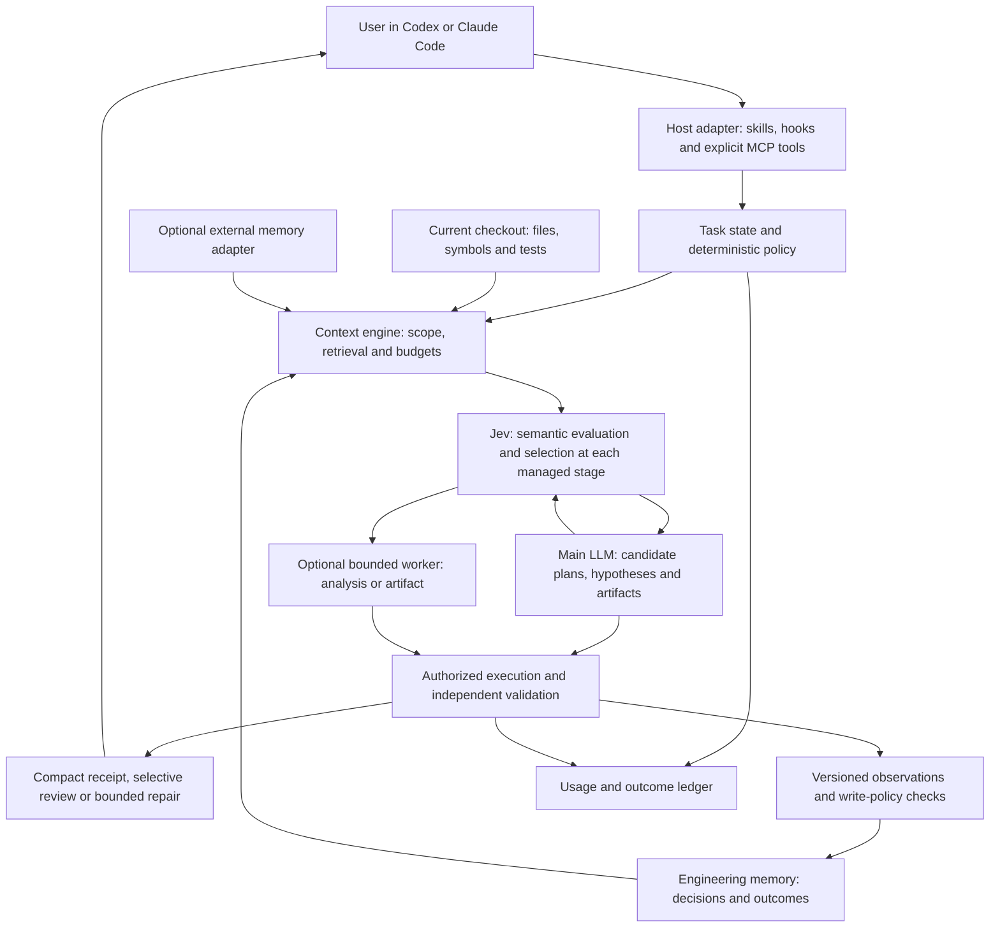

# Jevra development brain

Date: 2026-09-17. Status: adopted product direction; architecture and delivery slices are planned. The executable version remains `0.1.0-alpha.2`.

## Product decision

Jevra is an open-source development plugin for Codex and Claude Code that combines durable engineering memory, repository evidence, bounded delegated work, Jev judgments, and outcome/cost measurement. The existing reading optimizer becomes one module of this product.

Jevra is developed from scratch as a development-focused plugin with native engineering memory and bounded worker modes. Native memory is a core planned capability. Connections to external memory services remain optional and scoped.

Keep one repository and one product name. Users keep their existing coding agent. A separate chat UI, mandatory hosted platform, or public framework is unnecessary for the first complete workflow.

Desired outcomes are higher accepted-task success, better complex-problem resolution, continuity across sessions/hosts, and lower expensive-token consumption. These are objectives, not established alpha capabilities. Optimize cost subject to quality requirements; provide a measured higher-quality path when a harder task justifies more spending.

The owner subsequently assigned every explicit semantic decision in the managed workflow to Jev. [Decision architecture](decision-architecture.md) is authoritative for that ownership, registry and transition enforcement; optional workers remain generative helpers. This change is planned, not an alpha runtime claim.

## Responsibility boundaries

| Component | Owns | Does not establish |
| --- | --- | --- |
| Codex / Claude Code | User conversation, open-ended problem solving, plan/candidate generation, native execution permissions, integration and review-finding generation | That every hook recommendation was followed |
| Engineering memory | Versioned technical decisions, findings, failed attempts, validated outcomes and unresolved questions | That an old finding remains true in the current checkout |
| Repository evidence | Files, symbols, references, dependencies and test relationships from an authorized revision | Semantic completeness of a repository from a partial index |
| Context engine | Bounded retrieval, revision-aware caches, useful neighbors, exact evidence packs and progressive expansion | Permission to fetch unrelated projects or inject all stored memory |
| Jev | All explicit semantic judgments and selections in managed stages, over supplied evidence and eligible choices | Code/text generation, proof of correctness or authority to act |
| Worker modes | Bounded analysis, summaries or predictable artifacts using a configured generative model | Unlimited autonomous development or unrestricted commands |
| Verification and ledger | Source freshness, schemas, test receipts, artifact checks, observed usage and bounded repair | That a passing test covers every semantic requirement |

[AiKA Modes](https://backstage.spotify.com/docs/portal/core-features-and-plugins/aika/modes) is a public comparison for configurable instruction/model/tool boundaries. The engineering focus is Jevra's product choice; AiKA itself also serves broader organizational use cases. [System One](https://docs.typesafe.ai/concepts/system-one) supplies typed judgments rather than generated code. These capabilities have distinct responsibilities and evaluation criteria.

## Target architecture



The arrows describe information flow, not a required API call at every node. Exact operations need no semantic inference. Exact cached Jev receipts can satisfy an unchanged semantic evaluation; ordinary content-cache hits do not substitute for one. The host does not surrender its conversation loop to the plugin. A worker initially returns an artifact or answer; host-authorized execution applies and validates it. Unavailable integration surfaces retain native behavior, recorded as outside managed decision coverage. Jev unavailability suspends the dependent managed transition; it must not silently switch judges.

## Native memory requirements

Implement explicit records, provenance, revisions, idempotent writes, receipts, change cursors, correction/withdrawal and a search/read interface. Scope records to repositories, worktrees, code revisions and engineering outcomes. Validate the implementation with independent tests and synthetic fixtures.

The default installation must operate independently of organization-specific infrastructure. Keep deployment configuration, credentials and user records outside the public repository. External service adapters use explicit, scoped contracts.

Publishing the plugin must never imply publishing a user's repository index or task history. Local memory stays outside Git by default.

## Engineering memory model

Use three lifetimes rather than a single collection of chat summaries:

| Layer | Examples | Freshness and retention |
| --- | --- | --- |
| Repository knowledge | Component boundaries, interfaces, symbols, dependency edges, test entry points | Derived from current files; invalidate by content hash/revision and rebuild |
| Durable engineering memory | Accepted design decisions, constraints with authority/source, verified bug root causes, rejected approaches with reasons | Retain provenance and supersession; revalidate applicability before reuse |
| Task working state | Requirement IDs, hypotheses, evidence read, next investigation step, pending checks, artifact handles, current budget | Session/task scope; bounded TTL, explicit continuation; never a dump of hidden reasoning |

Suggested record kinds: `architecture_decision`, `constraint`, `code_observation`, `bug_investigation`, `attempt`, `validation_result`, and `open_question`. Keep `candidate`, `active`, `superseded` and `withdrawn` lifecycle state separate from `observed`, `user_accepted`, `test_verified` and `hypothesis` evidence status. Semantic similarity is not sufficient to merge two decisions.

Minimum record fields:

```text
id, schemaVersion, kind, lifecycle, evidenceStatus
scope: projectId, repositoryId, worktreeId?, visibility
content: title, statement, rationale?, requirementIds[]
provenance: sourceRefs[], sourceHashes[], commit?, dirtyTreeFingerprint?, authorKind
validation: checkRefs[], outcome?, environmentFingerprint?
revision, createdAt, updatedAt, supersedes?, invalidationReason?
```

These are proposed internal contracts, not an implemented API. Paths and hashes are references, not provider-upload authorization. A commit alone is insufficient for a dirty checkout; worktree identity prevents treating uncommitted experiments as another branch's facts. Stable repository identity must not rely only on a local directory name or credential-bearing remote URL. Explicitly bound workspaces can share an authorized project store; separate projects remain isolated by default.

### Writes and corrections

- User-requested technical memories can be stored under configured scope. Do not ask for confirmation again for each already-authorized low-impact write.
- Automatic observations are limited to the explicitly enabled capture policy and observed artifacts/checks. Store a failed command as an observed failure, not a proven diagnosis. An accepted decision requires an actual user/source acceptance signal.
- A model-proposed lesson stays a candidate until backed by evidence or reviewed. Jev evaluates whether two candidate statements conflict; code owns persistence and the final write policy.
- Use idempotency keys and revision preconditions. A replay returns the original receipt; conflicting payload reuse fails. Corrections preserve provenance and invalidate dependent retrieval/caches.
- Ordinary withdrawal removes an item from retrieval and preserves an auditable tombstone. Explicit purge also deletes retained payloads and derived embeddings/caches; exports/backups need their own retention/deletion handling. Do not market a tombstone as secure erasure.
- Store concise technical evidence, not complete private conversations by default. Memory is reference material, never a higher-priority instruction or a remembered permission grant.

## Storage and retrieval

Preserve TypeScript/Node and the existing host-managed stdio MCP transport. Default to an embedded local store outside Git; recommend SQLite with FTS5 for the first implementation, subject to verifying the chosen Node binding, packaging and concurrent use on supported platforms. [FTS5](https://www.sqlite.org/fts5.html) provides lexical search and BM25 ranking without requiring an embedding service.

Keep database transactions, migrations, backup/restore, deletion and corruption recovery in DR-029. Multiple host processes need tested locking and revision checks; stdio is not a singleton guarantee. Versioned exports are explicit and scoped; a Git clone is not automatically a full memory backup. A shared server with user authentication and record-level access can come later behind the same storage/provider interfaces.

For retrieval, start with lexical search plus structural repository candidates. Add embeddings only when recall measurements justify ingestion, update and query cost. Jev ranks a bounded candidate set; the context engine returns exact relevant spans, freshness and gaps. Do not rank the entire repository or brain in one request. Include neighboring definitions, requirements and counterexamples where the task needs them.

Only authorized roots and file classes are indexed. Honor repository excludes plus explicit secret/build/vendor exclusions; a file being tracked by Git does not make it safe to upload. Update derived indexes incrementally from content changes; a stale index must be visible or rebuilt. Memory retrieval and code retrieval have separate provenance even when combined in one context pack.

## How a complex programming task runs

Example: an intermittent duplicate-write bug spans a request handler, retry logic and storage layer.

1. The host identifies requirements and reproduces the failure. The plugin retrieves relevant code, prior design decisions and applicable failed attempts, all tied to current source versions.
2. The principal LLM proposes competing hypotheses and an investigation plan. Jev evaluates evidential support and selects eligible next steps, or abstains; it does not generate the diagnosis. The LLM may need to propose more alternatives.
3. A bounded worker can inspect an isolated question or prepare a predictable test artifact. Independent work is optional and budgeted; parallelism is not the default answer to complexity and does not imply fewer tokens.
4. The host executes permitted checks. The runtime records outcomes against actual commands, artifacts and source hashes. A worker report that says a test passed is not a test receipt.
5. The main LLM integrates a patch and generates review findings. Jev evaluates finding support and semantic requirement coverage; independent regression checks and deterministic gates govern completion. Unsupported or conflicting findings trigger targeted expansion, not forced completion.
6. Persist a compact verified outcome and references under the capture policy. A later Codex or Claude session can retrieve that outcome without inheriting the whole transcript. If the underlying code changed, show it as needing revalidation.

This is a proposed lifecycle, not an existing autonomous solver. The task state machine is `collect → investigate → propose → validate → accept | repair | escalate | stop`, with cancellation and a finite repair budget. Suggested plans are LLM output; executable commands still pass through native authority. Stop conditions include missing authorization, exhausted budgets, unavailable evidence and repeated unproductive repair.

## Modes and cost policy

Initial mode candidates:

| Mode | Execution | Output |
| --- | --- | --- |
| `context-reader` | Deterministic candidate retrieval + Jev selection | Exact evidence pack; existing alpha behavior evolves here |
| `bulk-analyst` | Optional generative worker | Focused answer with source references and omissions |
| `artifact-writer` | Optional generative worker | Staged predictable code/config/test artifact and receipt |
| `evidence-auditor` | Exact checks + Jev semantic evaluation | Supported/contradicted/unknown findings, never automatic approval |

Each mode pins instructions, schema, provider/model, allowed inputs, output limits, timeout, tools and retry policy. Keep tools disabled for the first generative modes. The main agent generates architecture/debugging alternatives; Jev evaluates and selects within managed stages. Any later specialist investigation must be a separate evaluated mode with the same decision contract.

Choose workers from user-configured providers by measured task capability and effective cost, not only advertised model size. No particular auxiliary provider/model has been selected. A Codex or Claude subscription login does not automatically supply a reusable worker API entitlement; any supported worker transport and credentials must be explicit. The API-driven Jev service also remains an external dependency; open-source plugin code does not include model weights or free inference.

Measure accepted-task success and resource use together. On straightforward generation, prefer cheaper routes if quality is preserved. On complex debugging, allow a higher-cost principal path when evidence predicts higher success. Record the selected tradeoff rather than promising simultaneous maximum accuracy and minimum cost on every task.

## Delivery sequence and first complete slice

| Stage | Deliverable | Existing/new issues |
| --- | --- | --- |
| Foundation | Decision registry and receipts, ordinary plugin activation, telemetry and explicit contracts | DR-034, DR-018, DR-020, DR-028 |
| Native memory | Local store, lifecycle, retrieval and cross-host continuity | DR-029, DR-030 |
| Useful context | Incremental source-bound knowledge, impact profiles, structural retrieval, cache and progressive expansion | DR-035, DR-036, DR-031, DR-021, DR-024, DR-009 |
| Delegated work | Bounded summary then artifact modes | DR-022, DR-023 |
| Complex-task support | Assumption/hypothesis ledger, independent review, scoped lessons and Jev routing | DR-037, DR-038, DR-032, DR-025, DR-015 |
| Validation and release | Independent complex tasks, continuity and cost evaluation | DR-033, DR-019, DR-027, DR-012, DR-013 |

After the minimal DR-034 registry/receipt foundation, the first vertical slice is deliberately narrower than the product: save one explicit architectural decision with provenance in an authorized repository, end the host session, retrieve it in a fresh session of the other host, edit the referenced source, and prove that the memory becomes stale rather than silently reused. Add lexical candidate retrieval, Jev applicability selection with a receipt, and one bounded evidence pack. Run the same task without memory to measure context and turn overhead. No worker or embedding provider is needed for this first slice; it establishes the new durable foundation and baseline.

DR-026 remains a separate optional connector for an external memory service. It does not satisfy the native engineering-memory requirement. DR-017 remains a later public-framework decision; the internal modules can evolve before their APIs are promised stable.

## Evaluation and completion criteria

Keep the existing alpha pilot as historical evidence; it measured neither persistent memory nor these workers. Extend the [token-efficiency protocol](token-efficiency-plan.md) with:

- **Continuity:** fresh sessions and host switching, without the previous transcript; save/recall/correct/withdraw round trips; source changes, branches/worktrees, and simultaneous clients.
- **Memory quality:** provenance validity, correct applicability, stale-answer rate, cross-project isolation, conflicting decisions and rejected hypotheses not resurfacing as facts.
- **Complex programming:** independently reviewed multi-file bugs, refactors, missing requirements, misleading prior attempts and regressions; hidden acceptance checks outside the agent's writable checkout.
- **Economics:** full lifecycle cost, including memory ingestion/index updates, retrieval, cache storage/maintenance, Jev, workers, host rereads, repair and failed attempts. Report single-task and repeated-project costs separately.
- **Ablations:** native; deterministic retrieval; native memory without Jev/workers; worker without Jev; same worker with Jev. Isolate memory, Jev and generation effects rather than attributing the whole combination to one component.
- **Release:** explicit opt-in capture/upload configuration, supported install/upgrade/remove, backup/restore and per-host acceptance. An uninstalled plugin must not silently delete retained memory.

Freeze task sets, quality margins, cost targets and statistical design before confirmatory spending. Higher success at modest extra cost and equal success at lower cost are different outcomes; publish both when observed. Failure to beat a control is a reason to revise the route, not hide the run.

## Workflow concepts and semantic ownership

The [decision architecture](decision-architecture.md) adds an incremental source-to-knowledge compiler, evidence-backed assumptions, project impact profiles, isolated review and scoped lessons. These extend memory/index/investigation contracts; they share the same product and runtime. Jev owns the semantic judgments at each applicable stage. Executable validation, explicit user instructions and native permissions retain their authority.

## Decision record

- Adopted by the owner: Jevra as the complete development-focused product, developed from scratch; open-source code; Codex/Claude interface retained.
- Recommended architecture: native local engineering memory, optional external memory, versioned worker modes, Jev for all explicit managed semantic judgments, principal LLM for candidate generation and complex reasoning, verification and budgets throughout.
- Preserved: evidence-only use remains available; native permissions and current alpha behavior remain unchanged until implemented.
- Still to validate: storage binding, actual memory/worker transports per host, auxiliary model selection, semantic thresholds, index strategy beyond lexical/structural retrieval, and the effect on real task success/cost.
