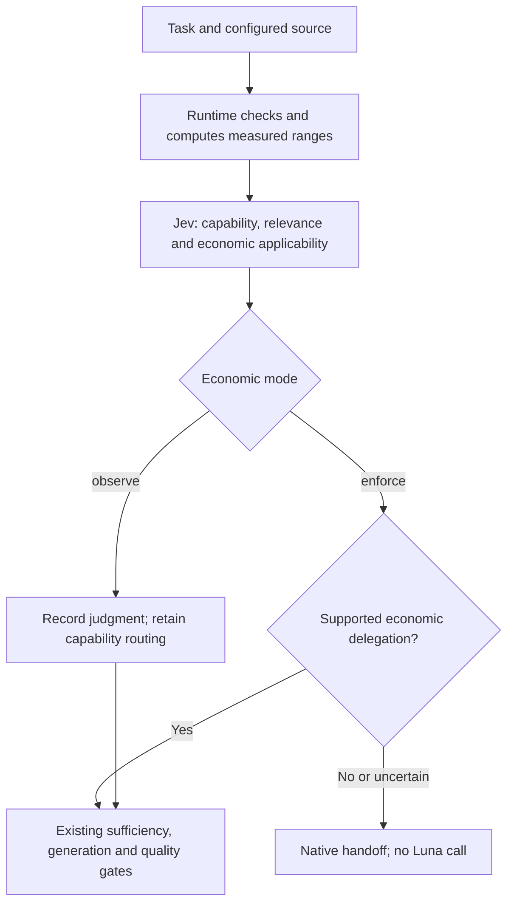

# Evidence-based economic routing

> Current correction contracts (2026-09-18): see [focused reader and corrected decisions](focused-reader.md). Fixed artifact packets now share route/support; economic routing defaults to narrow membership and code-owned eligibility. Dated diagrams/diagnostics below remain scoped to their recorded version.

Status: experimental opt-in, 2026-09-18. This implements the second increment of
the [Shunt audit](shunt-cost-audit.md), under DR-020/025/034. It does not establish
lower cost. The existing capability-only path remains unchanged when economic
configuration is absent.

## Decision and enforcement

The initial Jev request now optionally batches three independent judgments:
capability routing, passage relevance and `economic_route`. There is no additional
network round trip, but the extra state/question still consumes tokens. All later
evidence, quality and continuation gates remain required.



Code computes totals, range bounds, freshness and fixed policy requirements. Jev
decides whether the measured task family applies to the current task and supports
delegation. Byte size and requirement count only exclude out-of-range comparisons;
they do not replace semantic applicability. The model cannot invent cost numbers
or authorize an option absent from the runtime's candidate set.

Only comparable, complete observations with equivalent passing checks, observed
helper use, sufficient pairs and a positive conservative margin offer `delegate`.
Jev can still select `native` or `insufficient`. In enforce mode, either of those
or a low-confidence judgment hands off before sufficiency/generation. Receipts
distinguish `economic_native_selected`, `economic_evidence_insufficient` and
`economic_uncertain`. An explicit native user preference still bypasses inference.
Observe mode records the extra judgment while leaving capability routing in force;
malformed provider results still fail the normal typed-response contract.

## Configured evidence, not guessed savings

`testArtifacts.economics` is optional user-owned configuration. It is not a
`generate_tests` argument, cannot be changed by the parent model's tool call,
and is included in policy hashes and native-ticket configuration binding.
Example of **observation without a calibration**, which cannot justify savings:

```json
{
  "mode": "observe",
  "metric": "total_tokens",
  "execution": {
    "host": "claude-code",
    "delivery": "native-ticket",
    "parentModel": "claude-sonnet-5",
    "parentEffort": "low",
    "parentCliVersion": "2.1.274",
    "workerModel": "gpt-5.6-luna",
    "workerCliVersion": "0.154.0-alpha.6.2",
    "contextHash": "0000000000000000000000000000000000000000000000000000000000000000"
  },
  "minPairs": 3,
  "minSavingsFraction": 0.1
}
```

Replace the example context hash with the identity of the recorded host tool/skill
catalog, runtime/configuration and cache conditions before attaching measurements.
The MCP adapter supplies the actual host identifier and delivery mode. Parent
model, effort, CLI version and context identity are operator declarations, not
runtime attestation: receipts explicitly state `parentExecutionVerified: false`.
Change or remove the configuration when the parent setup changes. No subscription
plan, model price or cache discount is inferred from a model name.

The optional `calibration` uses the strict schema in
[`economics.ts`](../packages/core/src/economics.ts):

- `version: "economic-route/1"`, source report `evidenceHash`, matching `execution`
  and `metric`, measurement/expiry times, and `taskFamily` describe its provenance.
- `accounting: "whole_task_including_failures_and_recovery"` declares the required
  accounting scope. Source-byte and requirement-count ranges bound applicability.
- `equivalentQualityChecks` and each pair's native/managed quality outcome must
  establish comparable passing checks. `helperUsed` must be observed, not assumed.
- Each of at most eight unique pairs has `native` and `managed` component ranges
  for `parent`, `worker` and `jev`. All attempts, cache classes, repairs, routing
  hooks, fallback and recovery belong in the respective whole-task component.
  Unknown components are `null`; zero means a known absence of usage.

These declarations do not authenticate a benchmark or manufacture independent
labels. Calibration ingestion/review is still operator-owned; no automatic report
importer or default production calibration is shipped. In particular, neither the
legacy delivery pilot nor the unpaired compact-delivery diagnostic is suitable as
a new matched native-ticket calibration. Synthetic test values must never be
installed as measurements.

## Calculation and limits

For each complete pair, sum parent + worker + Jev ranges within each arm. Across
the admitted pairs, retain the lowest lower bound and highest upper bound for
each arm. Do not drop failed/expensive attempts or average away an outlier.

```text
net benefit = [native.low - managed.high, native.high - managed.low]
conservative fraction = (native.low - managed.high) / native.low
```

A zero native lower bound leaves the fraction unknown. The initial policy requires
at least three complete pairs and at least 10% conservative improvement to offer
delegation. These are explicit experimental screening rules, not calibrated
significance thresholds. Ranges describe observed measurements, not confidence
intervals or predictions of the next task. Jev's judgment does not transform them
into a proven forecast.

`total_tokens` sums input and output across components, including cached input
once. `api_equivalent_usd` uses externally documented scenario ranges; it does not
represent CLI subscription billing. Never combine different units or subtract
cache tokens as though cached inference were free. Actual bills and subscription
allowance remain unknown.

The extra question shares existing call/time/byte limits. The default artifact
question cap becomes 68 only when economics is configured; explicit lower limits
are honored. No model/transport/LLM-judge fallback is added. Calibration expiry is
rechecked before subsequent work, including repair. No calibration text or model
metadata is added to the Luna packet or later Jev requests. Receipts retain hashes,
computed ranges, policy, issues and judgment, without private family descriptions.

Returning to native work still pays the hook/tool invocation and initial Jev call.
That screening overhead must be included in the next benchmark; a denied worker
call alone is not evidence that the complete task became cheaper.

## Validation and activation

Offline tests cover complete/unknown accounting, negative and overlapping ranges,
outliers, failed quality, unused helpers, stale/mismatched contexts, caller override
rejection, observation/enforcement, receipt privacy, budgets, expiry during work,
native preference and unchanged worker packets.

The live diagnostic uses four explicit **synthetic counterfactuals**, one Jev
request per case, no worker or parent execution and no retries. Cases are missing,
negative, positive and semantically unrelated evidence. This checks question
behavior, not savings. The [recorded results](../evals/reports/2026-09-18-economic-routing.md)
include uncertainty and the positive-case rejection; do not lower thresholds or
promote enforce mode to hide that result. Keep observation available for a properly
reviewed calibration and new task families before claiming reliability.

A [16-case follow-up](../evals/reports/2026-09-18-economic-applicability.md) compared
the current Choice with an evaluation-only Noul limited to semantic family
membership. At the economic-only gate the narrow alternative accepted all four
authored positives, while the current question accepted none; neither accepted
the 12 blocking cases. Numeric admission remained in code and caveats stayed in
the shared state. This suggests separating the semantic question from arithmetic,
but does not authorize production replacement, forecast accuracy or enforce
promotion. The frozen evaluator's relevance gate differed from production and
its saved rows omitted relevance answers, so combined initial-route counters are
invalid; keep the audit rather than tuning or rerunning to hide it. All fixtures
were author-labeled and hypothetical. A fresh reviewed dataset and complete typed
answer capture are required next. The [corrected whole-task proposal](../evals/artifact-comparison-v2/protocol.md)
is offline preparation, with full host/accounting/cache checks still pending.

Sources reviewed on 2026-09-18: [TypeSafe Choice](https://docs.typesafe.ai/primitives/choice),
[Noul](https://docs.typesafe.ai/primitives/noul), [confidence](https://docs.typesafe.ai/confidence),
[JavaScript SDK](https://docs.typesafe.ai/sdk/javascript),
[confidence routing](https://docs.typesafe.ai/patterns/confidence-routing).
