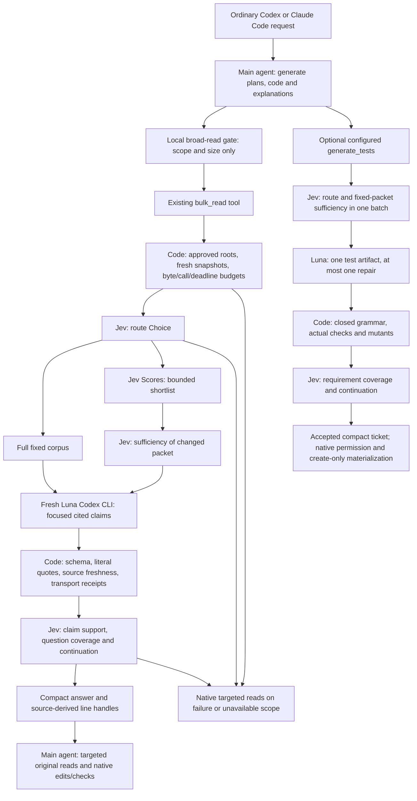

# Focused reader and corrected decision flow

Date: 2026-09-18. Status: implemented, opt-in developer alpha. The owner adopted the architecture-review corrections. This document describes the new runtime; dated reports and the frozen v1 evaluator remain historical evidence. No token/cost benefit has been established for this new path.

The next milestone is a smaller reader-oriented comparison over large and cross-file evidence, including subsequent native edits. Preserve compact artifact tickets and their actual checks. Engineering memory, additional worker roles and the large artifact matrix remain deferred until this substitution mechanism has quality and complete-task evidence.

## Data flow



LLMs still make implicit internal choices. Jev owns the explicit semantic transitions implemented in these managed workflows. Code owns arithmetic, hashes, authorization boundaries, closed schemas, source identity, deadlines and fixed checks. The diagram does not promise interception of every native host decision.

## Reader contract

Enable `bulkRead.reader` explicitly; default bulk reads still return original excerpts. `code_context` always retains evidence-only behavior, and the principal LLM writes production code. Both hosts use the same core and the pinned `gpt-5.6-luna`/low Codex CLI generator with official ChatGPT authentication. No direct API generator or alternate model is selected on failure.

Full mode sends the complete admitted file corpus to Luna in one fresh bounded packet. Its first Jev request chooses the read-only route using the question and source descriptors. It does not claim that the answer exists. The second Jev request evaluates the generated claims against mandatory cited passages and bounded lexical counterevidence. Thus successful full mode requires **two Jev calls and one Luna generation**.

Selected mode batches route and independent passage Scores, then asks sufficiency against the exact changed packet before generation. The same final review follows: **three Jev calls and one Luna generation**. Selection can lose required facts. Native targeted recovery and its tokens must be measured; a smaller worker prompt alone is not a quality or cost win.

Luna returns strict JSON inside the shared transport's `content` string: `status`, at most six short `claims` with runtime-issued passage IDs and literal source quotes, and at most four `gaps`. Runtime checks IDs and exact quote substrings, derives line numbers from original snapshots, verifies current sources and rejects invalid transport/hash/auth/tool/cleanup receipts. Jev evaluates claim support as Choice, bounded question coverage as Noul and continuation as Choice. Unsupported, contradictory, uncertain, malformed or insufficient output yields a compact native-read fallback, with no uncited model body. There is no autonomous expansion or second generation.

Review covers **cited spans and bounded counterevidence**, not every omitted passage or unseen repository file. A passing Jev gate is provisional semantic evidence, not a correctness proof or calibrated probability. Native original reads remain necessary before exact edits. Public synthetic offline tests do not establish resilience to arbitrary adversarial source text.

## Configuration and privacy

This excerpt belongs inside an existing version-1 configuration:

```json
{
  "mode": "advise",
  "model": "jev-1.13.0",
  "keychainService": "codex-typesafe-api-key",
  "bulkRead": {
    "roots": ["/absolute/path/to/approved/project"],
    "transport": "mcp",
    "reader": {
      "enabled": true,
      "experimentalProfile": "focused-reader/1",
      "codexExecutable": "/Applications/ChatGPT.app/Contents/Resources/codex",
      "selection": "full",
      "maxCorpusBytes": 65536,
      "maxWorkerBytes": 131072,
      "maxOutputBytes": 8000,
      "maxOperations": 1
    }
  }
}
```

The executable/version/model remain pinned by transport preflight. Existing corpus loader caps still apply in addition to reader caps. Oversized input, an oversized mandatory review packet or a result exceeding the output budget fails closed; cited sources are never silently dropped to fit. These are byte/invocation limits, not enforceable subscription money/quota limits.

Enabling this reader authorizes sending admitted source text and relative file/line/hash metadata to the authenticated Luna CLI. Jev receives the question/source descriptors, selected evidence when applicable, then cited passages, counterevidence and candidate claims. Relative names and source text may contain sensitive information. The existing root policy must cover all supplied files; no repository discovery or source tools are available to the worker. The CLI keeps its official authentication location and receives no parent history, API keys, inherited instructions or tool integrations.

MCP maintains a process-local session with a hard operation capacity. Identical packets reuse the same result, including failures; the configured replay TTL defaults to five minutes. Scope, caller session, configuration, policy and source hashes bind reuse. Changed sources/queries cannot evade the session cap. CLI calls each create a fresh process-local session; cross-process deduplication is not implemented. MCP allows one active tool operation and returns busy on competing requests.

Private journals under the configured state directory's `readers/` folder reserve each paid invocation before dispatch. They contain IDs/hashes, full fixed-registry typed Jev answers, usage, worker receipts, statuses and coverage counts; no source/claim bodies or paths. Files use mode 0600 in private session directories. There is no automatic reader-journal retention cleanup in this alpha; operators can remove these metadata directories when no operation is active. Persistence failure blocks the next invocation. Crash-started entries remain unknown.

## Artifact and economic corrections

Configured test profiles now default to `packetMode: "fixed"`: keep every mandatory source, batch route and per-requirement sufficiency, then review after actual checks. Success uses two Jev batches; a repair adds one. Generic selected-packet operations retain a separate sufficiency request because ranking changed the assessed packet. Receipts bind packet mode and the `managed-test-worker/4` policy version. Full typed Scores/legends are retained.

When optional economic routing is configured, `family-membership/2` is the default question profile. Code calculates whole-task ranges, eligibility, quality/comparability gaps and expiration first. In enforce mode, ineligible evidence produces a deterministic native handoff with **zero inference**, explicitly recorded as `deterministic_policy`. Otherwise Jev answers only task-family membership with Noul; it never calculates savings or attests operator metadata. An uncertain/unrelated family cannot authorize delegation. Observe mode records evidence without enforcing admission. No real default calibration or automatic ingestion exists.

`compound/1` remains an explicit legacy compatibility profile, and its original question is preserved for frozen diagnostics. Production thresholds were not lowered. The new [v2 applicability evaluator](../evals/economic-applicability-v2/protocol.md) uses production gates and retains all typed answers. It does not rescore missing v1 Scores or convert hypothetical component ranges into measurements.

## Evaluation and remaining evidence

The [exploratory reader protocol](../evals/reader-comparison/protocol.md) replaces the large artifact expansion as the next experiment. It provides ordinary native targeted-read, original-excerpt, full Luna without managed Jev, full managed reader and selected managed reader arms. Four authored workloads have exact fact/citation and closed pure-function edit checks. The runner freezes the selected cells, instructions, source/requirement hashes, model versions, cache interpretation and hard budgets before dispatch; default execution is capped at two cells.

The [first live Codex pair](../evals/reports/2026-09-18-reader-comparison.md) completed both cells with passing authored fact/citation and code checks and complete input/output accounting. The offered reader was not invoked: no Luna or Jev inference occurred. The local large-read gate was not enabled in that scoped protocol. This exposes an ordinary-adoption gap, not a measured reader benefit; verify scoped gate delivery and instrument adoption before expanding the experiment.

The subsequent [zero-inference gate validation](../evals/reports/2026-09-18-reader-gate-validation.md) passed 14 direct packaged-hook cases, listed the MCP tools and verified one scoped Codex definition's normal transition from untrusted to trusted. Guidance no longer suggests the unnecessary optional session identifier, making it compatible with the strict evaluation MCP. The collector and gate journals were then wired into a [v1 task diagnostic](../evals/reports/2026-09-18-reader-gate-task.md): authored quality passed, but no helper ran and native gate execution/delivery remained unknown. V1 readiness loaded user config while its parent ignored it. V2 aligns that context, disables unrelated MCPs with scoped flags and records configured active gate entry before parsing/eligibility. At the v1 increment these corrections had offline/zero-inference validation only; the subsequent live observation follows below. Preserve the frozen v1 source snapshots and use fresh reviewed preparation for future bounded diagnostics. Native readiness alone is not evidence of hook execution or helper benefit.

A subsequently [fresh v2 cell](../evals/reports/2026-09-18-reader-gate-task-v2.md)
observed five configured active gate entries, one redirect and one answered helper.
One full-corpus Luna generation and two Jev route/review requests completed; exact
citations and authored task quality passed. Parent plus helper/provider usage was
128,778 tokens. Only six cited/counterevidence passages received semantic review;
this is not full-repository attestation or a selected-corpus Score experiment.
Compact delivery is observed, while whole-task efficiency remains unproven. The
next comparison must match native/reader host configuration and instructions,
include all inference, and preserve cache/independent-label caveats before corpus
selection or memory expansion. Original v1 and v2 observations remain unchanged.

Component adapters reconcile parent, worker, managed Jev and routing-hook journals. Failed usage remains a known subtotal where observable; absent/started/incomplete entries cannot become a zero-cost success. Codex cached input is already gross, while Claude uncached/read/creation counts are added once. Actual charges, quota consumption and cache-dependent USD estimates remain null. No hook inference is enabled in this particular scoped protocol; failure-injection tests cover missing/failed hook accounting for a future hook ablation.

Offline checks cover citation validation, source changes, semantic rejection, malformed/unknown usage, cancellation/cleanup, idempotency, API/worker budgets, MCP/CLI composition and authored quality oracles. Live host adoption, cost/quality improvements, independent held-out applicability labels, statistical repetitions and full plugin activation certification remain unproven. Preserve historical negative/null results. These implementations make the experiment possible; they do not establish savings or superiority to Spotify.
