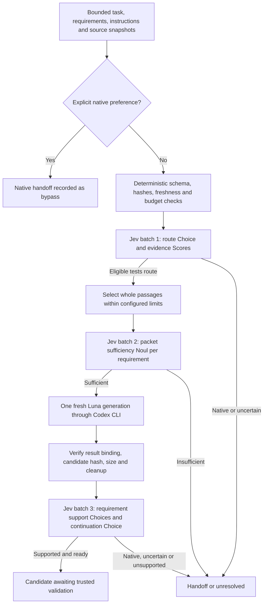

# Managed test-generation operation

> Current correction contracts (2026-09-18): see [focused reader and corrected decisions](focused-reader.md). Fixed artifact packets now share route/support; economic routing defaults to narrow membership and code-owned eligibility. Dated diagrams/diagnostics below remain scoped to their recorded version.

Status: internal experimental implementation, 2026-09-17. This is the minimum
DR-020/025/034 slice. An optional [DR-023 validator](test-artifacts.md) now adds
staging, actual checks and one repair for a restricted pure-function profile.
The validator mode is now exposed through [explicitly configured MCP tools](artifact-mcp.md).
Evidence-only operation remains the default.

`packages/core/src/managed-worker.ts` connects the existing TypeSafe provider to
the Codex CLI transport. One `ManagedTestOperation` owns one immutable request,
its decision receipts and its usage ledger. Repeated `run()` calls on that object
join the same promise. Creating a different object is a different budget; durable
cross-process deduplication and durable budgets are not implemented. The MCP
wrapper separately enforces process-local idempotency, one operation per profile,
and a finite session capacity.

## Implemented flow without a validator

Independent judgments share a batch. The sufficiency stage sees only the selected
evidence that generation will receive, rather than evidence removed by the budget.
Candidate review reads actual candidate text and supplied source contracts. Its
continuation question inspects that same state independently; it does not consume
the other answers in its batch. Code permits `awaiting_validation` only when every
required support answer and the continuation answer meet the configured policy.

Without a validator, the profile only generates candidate text and cannot stage,
execute, repair or apply it. With the runtime-owned validator, required checks
precede the completion judgment; see the [artifact lifecycle](test-artifacts.md).
A native handoff is a returned outcome; it does not invoke the host or prove adoption.

## Decision contracts and bindings

The current question/policy registry version is `managed-test-worker/3`. The module's
three stages define closed candidates, primitive types, state construction and
outcome policy. Routing includes `tests`, `native` and `abstain`; requirement
review includes `supported`, `contradicted` and `insufficient`; continuation
includes `validate`, `native` and `abstain`. No candidate means no implicit match.

Optional trusted [economic configuration](economic-routing.md) adds an independent
`economic_route` Choice to the first batch. It records measured ranges and can
hand off before generation; no economic state is copied into the worker packet.
This opt-in path is uncalibrated and has no default empirical measurements.

Requests carry an operation ID, scope hash, source revision, explicit requirements,
instructions and evidence. `sourceHash` hashes the exact UTF-8 evidence content
using SHA-256; it is not the hash of a surrounding file or JSON-encoded string.
Duplicate evidence IDs and content/hash mismatches are rejected. The snapshot is
cloned and frozen before asynchronous work.

The runtime must supply `currentBinding(signal)`, which rereads the authorized
scope, revision and exact evidence hashes. The operation checks it before and
after inference and generation, and before final delivery. Changed or deleted
evidence, changed scope and changed revision stop continuation. The callback is a
trusted dependency, never a caller-provided success boolean or model argument.
The original synthetic probe has immutable synthetic sources. `NodeTestArtifacts`
now supplies filesystem-backed source/output bindings for its single-source profile
and an explicit no-overwrite apply operation; repository-wide application remains open.

Each provider receipt binds the operation's source state, exact provider request
and question set. Candidate review's request hash also binds the actual generated
text. Transitions reference validated receipts owned by the same operation. The
runner accepts no imported receipts or semantic cache entries. Hashes alone are
not an authentication mechanism; an external receipt-import feature would need
its own trust boundary.

## Limits and failure behavior

| Default limit | Value |
| --- | --- |
| Jev requests / questions per operation | 3 / 50 |
| Bytes per request / total Jev request bytes | 49,152 / 147,456 |
| Worker packet bytes | 49,152 |
| Selected evidence items / serialized bytes | 8 / 16,384 |
| Candidate UTF-8 bytes | 32,768 |
| Jev stage timeout / operation timeout | 10 / 180 seconds |
| Generation invocations without a validator | At most one |
| Additional cleanup observation after interruption | At most 1.5 seconds |

Attaching the artifact validator changes the defaults to four Jev requests, 67
questions, 196,608 cumulative Jev request bytes and at most two generator
invocations. The second invocation requires Jev's repair selection. Other limits
and thresholds remain unchanged.

With economics configured, the default artifact question cap is 68 to account for
the additional first-stage judgment. Call and byte limits do not increase, and an
explicit lower question limit is still enforced.

Before generation, code also checks that the remaining call/question budget can
admit review. CLI IO, subprocess limits, auth and recursive-dispatch protection
remain owned by the [transport](worker-architecture.md#implemented-transport-boundary).
The operation cannot establish a hard provider-token or dollar cap: these are
bounded call/byte/time limits. The CLI may perform internal network work within
one invocation.

The provisional thresholds are confidence 0.70, selected Choice probability 0.80,
evidence Score 1.50 on a 0–2 scale and packet-sufficiency Noul 0.85. They are
experimental parameters, not correctness guarantees. The
[first live diagnostic](../evals/reports/2026-09-17-managed-worker-probe.md) stopped
at the continuation threshold; these values were not changed to force a pass.

Outage, malformed answers, abstention, expiry, cancellation and exhausted budget
produce a structured unresolved outcome. Returned ledgers are immutable snapshots;
late provider responses cannot resume work or alter them. The worker transport
owns process termination. If cleanup does not resolve within its observation
window, cleanup and usage remain unknown. Never treat unknown cleanup as proof
that a process is gone.

## Accounting and privacy

The result separates the candidate body from its metadata receipt. The receipt
contains version/hash bindings, numeric judgments and distributions, transitions,
generation metadata, observed usage and sanitized failures. It excludes prompts,
instructions, source IDs/bodies, candidate bodies, paths, credentials and raw CLI
streams. Score legends are not copied into receipts.

Usage is split by Jev and worker. Each subtotal contains observed input, cached
input and output tokens, plus counts of unknown usage/cache entries. Cached input
is a subset of input, never an additional input charge. A zero observed subtotal
with unknown entries is not a zero-cost operation. Invalid semantic answers can
still carry observable usage. Unbound worker receipts cannot attribute another
operation's tokens to this one. Failed generation and review remain accounted.

Main-host usage, actual dollar charges and subscription consumption are `null`.
There is no cross-provider dollar total or claimed subscription saving. The core
ledger is in memory; explicit probes persist sanitized reports in the ignored
local-results directory. The artifact validator separately persists private
candidates/check receipts and accounts for repair. Cross-process resume, retention
and whole-host reconciliation remain follow-on work.

## Validation and next increment

Twenty-five offline tests cover successful composition, official SDK wire requests,
the real subprocess parser with a fake executable, source freshness, malformed and
uncertain decisions, budgets, native bypass, cancellation, cleanup, usage gaps,
privacy and idempotent invocation. Sixteen artifact tests extend that coverage;
the complete repository check passed 108 tests. The first live probe, without a
validator, returned `unresolved/uncertain`. The later restricted artifact probe
passed observed baseline/mutation checks and Jev review. Neither is a broad
quality or efficiency evaluation.

The restricted DR-023 profile is now implemented; ordinary host invocation and
review/permission integration are next, followed by matched whole-task comparisons.
Retain the outstanding DR-039 capability gates before enabling the worker in plugins.

The question decomposition follows the official TypeSafe guidance on
[shared state](https://docs.typesafe.ai/concepts/state),
[typed dispatch](https://docs.typesafe.ai/cookbooks/function_calling) and
[confidence](https://docs.typesafe.ai/confidence), read on 2026-09-17.
