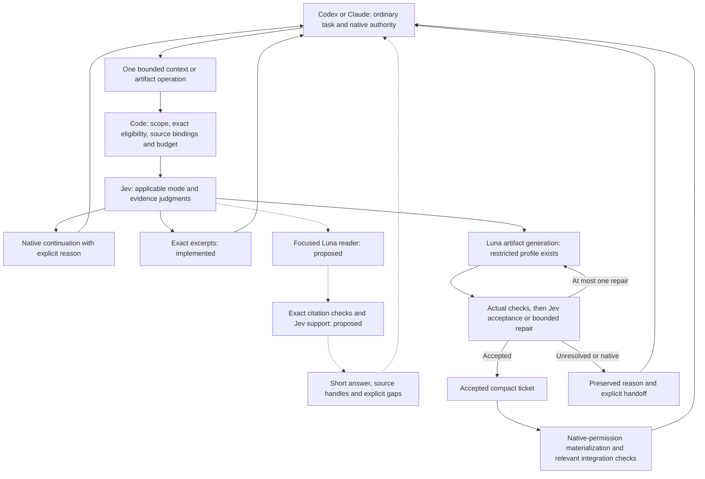

# Shunt and Jevra: architecture review after the artifact diagnostics

> Subsequent adoption: the owner accepted this review. See [implemented corrections](focused-reader.md) and [the smaller reader protocol](../evals/reader-comparison/protocol.md). The comparison below is the pre-correction snapshot; historical outcomes remain unchanged.

Date: 2026-09-18. Historical status: recommendation for discussion, not an adopted runtime
change or an efficiency claim. This review describes the current unreleased
working tree and supersedes older gap tables **as a comparison**, without changing
the delivery decision in SPEC. No new paid inference or live AiKA test occurred.

Spotify `origin/main` was fetched over SSH for this review and remains
`3c24ca30ff63e1f5bbad1c43fe5324daff579123`. Upstream local marketplace changes were
preserved; reviewed source was read through Git, not the modified marketplace.

## Verdict

Jevra has added coordination around tasks with very little expensive work to
remove. Its compact artifact path solves a real transport problem, but the
strongest Shunt opportunity remains largely untested here: keep a large corpus
out of the principal model, get a focused worker answer, and reread only the exact
evidence needed for an edit. We have not implemented that focused generative reader.

The next priority should be proving that data substitution and its quality floor.
The current 144/162-cell artifact proposal is too large for the uncertainty it
resolves and too narrow to evaluate the main Shunt mechanism. Fix measurement
defects, then run a smaller reader-oriented exploratory comparison with complete
task accounting. Preserve the existing artifact delivery and safety boundaries.
Adding more worker roles, a full engineering brain, or more Jev decisions on every
small operation does not address the observed bottleneck.

## What Shunt actually contributes

The public client implements two useful operations:

- `bulk-read`: pass approved file bodies and a question to the named `bulk-reader`
  AiKA mode; return its focused generated answer. A local PreToolUse hook redirects
  broad reads above 350 lines and permits targeted reads. The line threshold is a
  heuristic, not a measured universal break-even point.
- `code-write`: pass a spec and one required reference to `code-writer`, strip code
  fences, and optionally write the generated body directly to a target. Its skill
  asks the parent to review and make focused corrections. Writer use is advisory;
  no writer-enforcement hook is present.

Each delegation is a single client `aika:invoke-chat` turn without client-side
conversation replay. The reviewed helpers contain no application cache or native
engineering memory. The public mode configuration does not pin the model that
produced the published benchmark; the private server configuration was not tested.
These sources do not establish that a development brain caused Shunt's savings.

Sources: [reader script](https://github.com/spotify/portal-ai-plugins/blob/3c24ca30ff63e1f5bbad1c43fe5324daff579123/plugins/shunt/scripts/bulk-read),
[writer script](https://github.com/spotify/portal-ai-plugins/blob/3c24ca30ff63e1f5bbad1c43fe5324daff579123/plugins/shunt/scripts/code-write),
[read gate](https://github.com/spotify/portal-ai-plugins/blob/3c24ca30ff63e1f5bbad1c43fe5324daff579123/plugins/shunt/hooks/check-file-size),
[writer skill](https://github.com/spotify/portal-ai-plugins/blob/3c24ca30ff63e1f5bbad1c43fe5324daff579123/plugins/shunt/skills/code-writer/SKILL.md),
[transport](https://github.com/spotify/portal-ai-plugins/blob/3c24ca30ff63e1f5bbad1c43fe5324daff579123/plugins/shunt/scripts/lib/aika.sh).

Shunt's headline 82–94% numbers compare estimated main-context volume. The public
runner uses characters/4 and does not add all worker inference, parent reviews,
failed work or independent quality outcomes. Its writer proxy sets delegated
main-context cost to zero. Our [offline audit](shunt-cost-audit.md) also reproduced
apparent perfect savings after failed transport. That finding concerns the runner;
it does not invalidate historical successful outputs. We should transfer the
data-flow mechanism and measure it more rigorously, rather than treat those
percentages as verified complete-task savings.

Sources: [published table](https://github.com/spotify/portal-ai-plugins/blob/3c24ca30ff63e1f5bbad1c43fe5324daff579123/plugins/shunt/README.md#benchmarks),
[benchmark runner](https://github.com/spotify/portal-ai-plugins/blob/3c24ca30ff63e1f5bbad1c43fe5324daff579123/plugins/shunt/evals/run.sh).

## Current comparison

| Concern | Shunt public client | Current Jevra | Assessment |
| --- | --- | --- | --- |
| Broad-read interception | Local Read/Bash gate before corpus delivery | Local large-read gate exists; integration/lifecycle certification remains partial | Preserve it; measure actual intercepted and subsequent reads |
| Reader result | Focused generated answer | Jev-ranked original excerpts; parent synthesizes | Major missing capability for broad understanding |
| Exact edits | Targeted original reads remain available | Original spans and native tools remain available | Necessary grounding, not avoidable ceremony |
| Writer scope | Predictable output from spec/reference | Single pure numeric/boolean function, closed test grammar, configured mutants | Good bounded feasibility profile; very limited development coverage |
| Artifact transport | Optional direct-to-target script write | Legacy body review is default; opt-in accepted ticket + native materializer works in diagnostics | Copying was corrected in the compact path; default path still copies |
| Parent work | Invocation, review and focused correction | Invocation, optional skill routing/loading, native publication and checks; legacy path adds discovery/body copy | Count retained parent inference, not only removed file bytes |
| Explicit semantic ownership | Main agent; no Jev layer | Managed Jev route, relevance, sufficiency and post-check review | Product differentiator; needs isolated accuracy/value evidence |
| State | One-shot client delegation | Fresh bounded Luna CLI; no parent history; process-local operation replay | Already aligned; a new brain is not needed to obtain this property |
| Memory | Not implemented by the helpers | Broader native memory is planned | Separate future reuse experiment |
| Economic admission | Read-size heuristic and writer guidance | Optional observed-range contract, no real default calibration | Implementation exists; reliable benefit prediction does not |
| Quality evidence | Not established by the public token proxy | Actual closed-profile baseline/mutants; limited synthetic task checks | Retain checks; do not generalize them to arbitrary programming |

Local sources: [read gate](../packages/cli/src/bulk-read.ts),
[context selector](../packages/core/src/context.ts), [MCP surface](../packages/cli/src/mcp.ts),
[managed worker](../packages/core/src/managed-worker.ts),
[profile validator](../packages/cli/src/test-artifacts.ts),
[materialization contract](artifact-materialization.md).

## Where our reasoning and implementation went wrong

### 1. The experimental workload barely exercises the intended advantage

The artifact pilot supplied one-line functions and eight explicit examples.
There was little corpus to exclude from the parent and little long output to
substitute. In contrast, Shunt's published reader cases involve thousands of lines.
This does not mean bigger work automatically saves money; it means our pilot
cannot establish the benefit of that mechanism.

The new [v2 workloads](../evals/artifact-comparison-v2/fixtures.ts) improve output
coverage to 4/8/24 examples, but reuse the same two function sources. The 144/162
proposed cells remain six authored workloads from two families. Repetition cannot
turn them into independent real-project tasks. Keep this as an artifact/delivery
ablation, and reduce its exploratory scope until the reader opportunity and parent
overhead are understood. Do not execute the large proposal by default.

### 2. We optimized artifact copying, then kept treating it as the whole problem

Compact delivery is implemented and observed. Codex issued one generate request
and one materialization command without full-body reading. A scoped Claude hook
diagnostic also used that path. It is inaccurate to keep calling direct artifact
handoff entirely missing after these increments.

Yet the [original artifact pilot](../evals/reports/2026-09-17-artifact-comparison.md)
put at least 97.65% of each helper cell's upper cost scenario at the parent.
The [hook diagnostic](../evals/reports/2026-09-18-economic-routing.md) reported
121,444 parent input tokens within 128,812 total input, compared with 90,440 total
input in its description-only observation. These are cumulative input counts,
including cache, not the size of one prompt. Cache conditions and trajectories
differ; no causal cost estimate follows from that pair.

Removing a 315-byte copy cannot explain or eliminate all of that parent usage.
We need to observe tool/model-pass counts, skill loads, corpus exposure, rereads,
native recovery and cache classes. Host system/catalog overhead remains a
hypothesis where the provider does not expose a per-component breakdown.
Optimizing Jev's direct fee or removing inexpensive HMAC/file checks targets a
small or unmeasured part of the problem.

### 3. Economic eligibility and capability fit were conflated

A task can fit Luna and still cost more through delegation. The default capability
route has no empirically validated benefit test. The optional economic contract
has no shipped real calibration. Its existence does not solve small-task admission.

The [range calculation](../packages/core/src/economics.ts) is also an experimental
screen: minimum native lower bound minus maximum managed upper bound across
observations. It is conservative, but loses paired structure and is not a forecast
or confidence interval. Source bytes and requirement-entry count are weak workload
descriptors: grouped requirements can contain 24 examples in eight entries, and
the source length is constant across our v2 sizes. Output volume, task family,
cache and parent-interaction patterns need explicit measurement before automatic
benefit inference. New descriptors must not become invented future savings.

Use code for numeric completeness, freshness, costs and hard eligibility. Ask
Jev the remaining semantic question about applicability to a measured workload.
Missing or unfavorable numeric evidence cannot be repaired by a confident model
answer. Exploratory opt-in operations may collect evidence; they must not be
marketed as an economical default.

### 4. The current economic question asks for several judgments at once

The compound Choice combines family fit, benefit, equivalent quality, uncertain
execution metadata and native suitability. Its `native` and `insufficient`
alternatives can be plausible for overlapping reasons. This is a question-design
problem to investigate, not proof that Jev cannot route coding work.

In the [16-case diagnostic](../evals/reports/2026-09-18-economic-applicability.md),
economic-only acceptance was 0/4 authored positives for the current Choice and
4/4 for a narrow family-membership Noul plus numeric admission. Neither accepted
12 blocking cases. However, primitive, wording and gate semantics changed together;
the experiment does not isolate why the challenger behaved differently. It also
used hypothetical totals and no held-out labels.

The current [Jev 1.13 guidance](https://docs.typesafe.ai/model-jaggedness/jev-1.13)
warns about arithmetic, indirect questions, irrelevant state and assumed equivalence
between Choice and Noul. That supports a narrower formulation, not a threshold
change or automatic replacement. Keep audit caveats and numerical unknowns in the
runtime/receipts, and expose only the state needed for each semantic relationship.
Validate the new question separately with independent labels.

### 5. Decision ownership became too close to a mandatory sequence

The current artifact success path has route/relevance, selected-packet support,
and post-check review: three Jev batches. This dependency is justified when selection
changes what the worker receives. It is not necessarily the best shape for a
preconfigured single-source packet that will remain intact.

A proposed fixed-packet path could combine route and packet-sufficiency questions
in the first batch, then review the artifact after actual checks in a second.
This is valid only when the exact packet assessed is the packet delivered. A changed,
expanded or selected packet needs a fresh dependent judgment. Batch independent
questions; do not pretend they see each other's answers. Measure the change as
an ablation: fewer Jev requests alone will not remove dominant parent work.

Likewise, exact literal assertion coverage can be computed by the existing AST
parser for structured requirements. Jev should judge actual semantic relationships,
including non-literal obligations and supported repair options. Arithmetic, hashes,
counts and mandatory test execution are deterministic policy, not semantic choices
to delegate. All explicit managed semantic choices still belong to Jev.

Source: [TypeSafe fan-out](https://docs.typesafe.ai/patterns/fan-out).
Current shared confidence gates are provisional; stage-specific risk/abstention
policies need independent validation under [confidence guidance](https://docs.typesafe.ai/confidence),
not tuning to make these positive examples pass.

### 6. Adoption was encouraged before benefit was established

The prompt hook observed Claude helper use, but gross usage increased on a tiny
task. Successful activation is an integration result. It is not economic success.
The read gate is different: it reacts locally to an observed expensive broad read,
without a Jev API call of its own. We should measure this more direct trigger before
expanding semantic skill recommendation on every ordinary prompt.

Route at the relevant supported operation, apply exact eligibility first, and
keep advice compact. Do not rely on a writer hook that neither system implements.
Preserve the existing skill router as an independent opt-in experiment and compare
its incremental adoption/cost under matched conditions.

### 7. Evaluation and documentation failed to keep up with the runtime

The frozen applicability evaluator required relevance 2 instead of production
1.5 and did not save relevance answers. Its combined route conclusions are invalid
and cannot be honestly reconstructed from the saved data. The economic-only
comparison survives; preserve the original manifest/counters and audit.

New scoring must derive defaults from the production contract and retain all
typed answers on approved evaluation fixtures. Validate success, wrong candidates,
uncertainty, missing usage, failed hooks, non-adoption and native bypass before paid
runs. Keep model-generated tests and model acceptance separate from the independent
task judge. Equal grammar is now shared in code, but the v2 live adapters do not
exist; preparation utilities do not establish live parity.

Older dated gap tables also say all code is principal-generated or compact handoff
is absent. Treat them as historical snapshots and use SPEC/compatibility for current
state. A new review should not silently rewrite historical measurements or declare
its recommendations adopted.

## Proposed smaller architecture

Two managed product operations are enough for the next experiment: a focused
context operation and an artifact operation. Keep modes/internal stages behind
those operations; avoid one parent-visible tool per decision. Existing names can
remain for compatibility. This diagram is a proposed unified routing design;
the focused reader and its verification path are not implemented.



The focused reader should return bounded claims with runtime-issued source-span
identities and explicit gaps. Code verifies span existence, exact revision and
scope. Jev evaluates each claim against the cited original text and whether the
packet supports the requested obligations. Citation validity is not exhaustive
coverage of unseen files; no-answer/conflicting evidence and expansion need tests.
Exact editing uses original targeted source, not a generated summary. Required
counterexamples must survive selection.

The fixed-corpus and Jev-selected-corpus reader variants should use the same Luna
and output contract. Compare required-evidence recall before claiming selection
helps: our current line/byte chunks plus BM25 top shortlist can omit necessary
definitions, neighboring branches or cross-file relationships. Jev cannot choose
evidence that retrieval never supplied. Add structure/reference candidates only
where measured misses require them; a full repository compiler is not a prerequisite.

For artifacts, keep staged output, actual checks, one repair, compact accepted
tickets and native authority. HMAC, preimages and create-only publication serve
real integrity/permission boundaries and are cheap deterministic work. Do not
trade them for a background MCP write or arbitrary execution of generated code.
The pure-function test profile can remain a feasibility slice; broader generation
requires an independently specified validation/application profile.

## Delivery recommendation

| Order | Concrete work | Existing issues | Evidence required |
| --- | --- | --- | --- |
| 0 | New versioned scorer with production gates, full typed-answer capture, complete hook/native-recovery reconciliation | DR-020/025/027 | Offline failure injection; original defective run remains immutable |
| 1 | One bounded focused-answer reader reusing Luna transport; no tools, history replay or writes | DR-022/039, required DR-021 slice | Grounded answers, explicit gaps, invalid/stale citation rejection, controlled native expansion |
| 2 | Small ordinary-read exploratory comparison with large-file, cross-file, contradiction/no-answer and subsequent-edit tasks | DR-018/019/027 | Corpus really excluded from parent; independent required facts/final edit checks; matched native targeted-read baseline; all-provider usage |
| 3 | Narrow artifact/delivery and fixed-packet batching ablations where output volume may justify delegation | DR-023/025/027 | Equal prompts/grammar, same Luna/checks, separate managed/bypass results, retained parent work included |
| 4 | Only after a measured useful slice, expand validation profiles and minimal exact reuse/project memory | DR-024/028–033 | New capability/reuse pays for maintenance and preserves quality on its declared workload |

Start with native targeted reads, current exact excerpts, focused Luna on the
entire bounded approved corpus, and focused Luna on Jev-selected evidence. Separate
the selection contrast from generation and the skill-hook contrast from both.
An identical worker without Jev can remain an evaluation-only overhead/value
control. Choose a small exploratory budget before calls; no fixed giant matrix is
recommended here. Confirmatory claims require independent held-out tasks and a
predeclared quality floor after exploratory design errors are resolved.

Keep every required native integration check. Eliminate redundant narration and
full-body re-emission; do not eliminate checks merely because helper checks passed.
Report actual worker checks separately from publication/integration checks and the
independent benchmark judge.

## Economic and decision boundaries

For a declared common metric, compare:

```text
managed_total = parent_all_attempts + worker_all_attempts
              + managed_Jev_all_attempts + routing_hook_all_attempts
net_benefit = matched_native_total - managed_total
```

Parent includes all its inference/tool interactions; the two Jev components keep
routing hooks separate from managed judgments. Failed/repair/native-recovery costs
remain in their original components and are not added a second time.
Unknown components make the comparable total unknown. API-equivalent USD, gross
tokens, frontier-model tokens and subscription usage are separate measures.
Moving input to Luna can lower an API scenario while increasing aggregate tokens.
No current evidence establishes a matching reduction of CLI subscription allowance.

Jevra can own explicit semantic transitions inside its operations. Hooks cannot
remove hidden decisions from Codex/Claude's reasoning, and generated artifacts
contain implicit LLM choices. The product should promise observable Jev-managed
transitions and grounded outputs, not complete independence from LLM judgment or
verified superiority on complex programming before those claims are tested.

This review recommends a narrower next experiment, preserving the long-term
development-brain direction. It changes no runtime default, provider/model,
permission, threshold or activation policy. The last recorded local suite is
152 passing checks; no new test result or savings result is claimed by this review.
