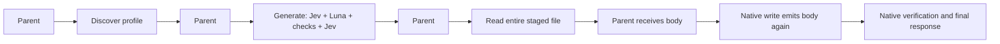
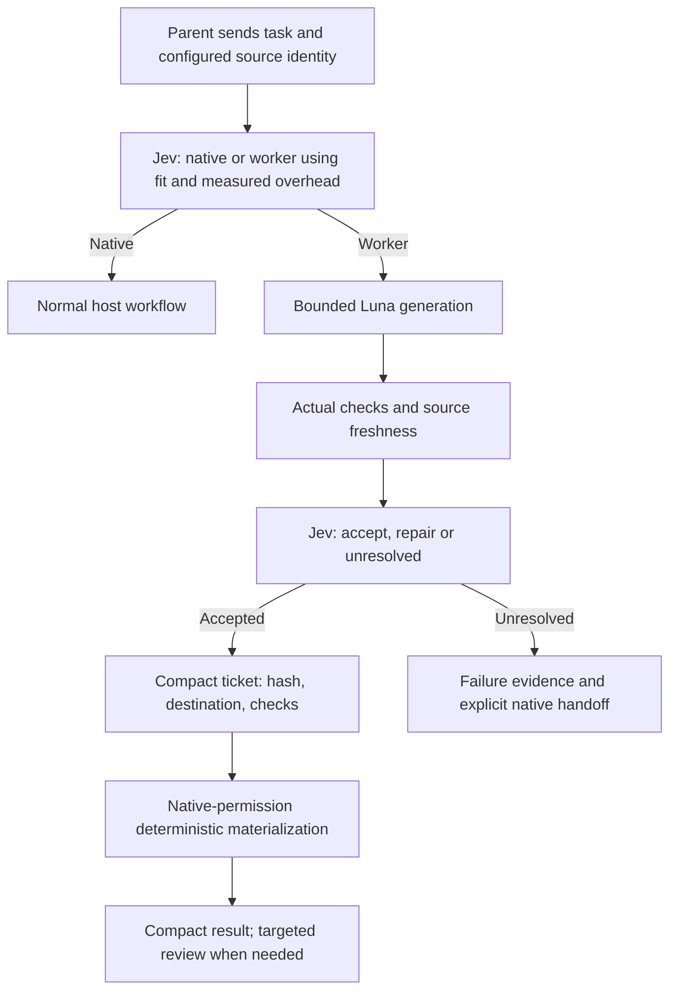

# Shunt cost audit and Jevra's next implementation

> Follow-up: compact native-ticket delivery and optional economic routing now exist. The [2026-09-18 architecture review](shunt-architecture-review-2026-09-18.md) describes current remaining gaps and recommendations. The source audit and measurements below remain the dated historical record.

Reviewed 2026-09-17 against Spotify commit
`3c24ca30ff63e1f5bbad1c43fe5324daff579123`, still `origin/main` when fetched over SSH.
This is a source audit plus a credential-free failure reproduction, not a live AiKA
comparison. Existing local upstream edits were excluded by using a temporary Git
archive. No upstream implementation is vendored into Jevra.

The strongest finding is an architectural mismatch: **our first worker delegates
generation but still makes the parent transport and re-emit the generated file**.
Shunt's writer can take the entire generated body directly to disk. Our three-tool
handoff adds parent interactions around a very small task, while our Jev router
currently evaluates capability without an economic-benefit input. Removing Jev or
switching Luna is not the first correction supported by the evidence.

## What the public Shunt client actually does

| Mechanism | Verified behavior | Consequence for Jevra |
| --- | --- | --- |
| Bulk reading | Local script sends source files to a worker and returns its focused answer | Avoid loading the corpus into the parent before delegation |
| Writing | One helper invocation accepts spec/reference/target, invokes the worker, strips fences and writes the target locally | Move artifact bytes through code rather than through another parent generation |
| Parent involvement | Writer skill still requests review and focused corrections | Direct-to-disk is not evidence of zero review cost |
| Selection | Large full reads are gated at 350 lines; targeted reads remain possible; writer use is advisory for predictable work | Treat scope/benefit as prerequisites; 350 is a read heuristic, not a demonstrated universal generation threshold |
| State | Each client delegation is independent; the reviewed helpers do not implement conversation replay or an application cache | Our fresh CLI worker already has this property; a new memory subsystem does not reproduce a missing Shunt prerequisite |

Sources: [bulk reader](https://github.com/spotify/portal-ai-plugins/blob/3c24ca30ff63e1f5bbad1c43fe5324daff579123/plugins/shunt/scripts/bulk-read),
[writer](https://github.com/spotify/portal-ai-plugins/blob/3c24ca30ff63e1f5bbad1c43fe5324daff579123/plugins/shunt/scripts/code-write),
[writer skill](https://github.com/spotify/portal-ai-plugins/blob/3c24ca30ff63e1f5bbad1c43fe5324daff579123/plugins/shunt/skills/code-writer/SKILL.md),
[read hook](https://github.com/spotify/portal-ai-plugins/blob/3c24ca30ff63e1f5bbad1c43fe5324daff579123/plugins/shunt/hooks/check-file-size),
[transport](https://github.com/spotify/portal-ai-plugins/blob/3c24ca30ff63e1f5bbad1c43fe5324daff579123/plugins/shunt/scripts/lib/aika.sh).

The client selects named AiKA modes, not a pinned public worker-model identity.
The reviewed source does not establish which model or optional server processors
produced the published results. Shunt also leaves architectural/debugging judgments
with its main agent. Jevra's intended semantic decision ownership is a deliberate
addition; it should live behind compact tools rather than create extra parent turns.

## The headline benchmark is a different metric

The README's 82–94% claims concern large-file context reduction, including examples
with 1,281–7,408 lines. They are not matched to our one-function/eight-case tasks.
See the [published table](https://github.com/spotify/portal-ai-plugins/blob/3c24ca30ff63e1f5bbad1c43fe5324daff579123/plugins/shunt/README.md#benchmarks).

The public [benchmark runner](https://github.com/spotify/portal-ai-plugins/blob/3c24ca30ff63e1f5bbad1c43fe5324daff579123/plugins/shunt/evals/run.sh)
uses a characters-divided-by-four proxy. For reads it compares corpus size with
helper-answer size. It does not meter a complete parent-agent task or add worker
inference. For writing, it weights estimated output by five and sets delegated
context cost to zero. Review, actual correctness, retries and subscription allowance
are not established by those numbers. Its writer baseline includes context files
that are not all passed to the worker: only the configured reference and spec are
sent. The public runner therefore cannot establish a matched quality/cost result.

There is also a failure-accounting defect: helper failures are swallowed and an
empty response can produce apparent perfect savings. The new
[offline audit](../evals/shunt-audit.ts) verified that behavior with a local fake
transport that always fails:

| Observation | Result |
| --- | --- |
| Direct bulk-read / code-write exit codes | 1 / 1, correctly rejecting the failed transport |
| Generated target | Absent |
| Benchmark exit code | 0 |
| Benchmark rows | All four report zero delegated tokens and 100% apparent savings |
| Live model calls | 0 |

[Sanitized reproduction data](../evals/reports/2026-09-17-shunt-measurement-audit.json).
This identifies a defect in the public measurement path; it does not prove that
the historical successful outputs or README numbers were false. The transferable
idea is keeping bulk data out of parent context, not treating that proxy as a bill.

## Where the current Jevra implementation loses the advantage

### 1. The artifact is staged, then sent through the parent anyway

[`ArtifactSession.list/generate/read`](../packages/cli/src/artifact-session.ts)
exposes three successive calls. The final read returns the entire body, and the
[host skill](../plugins/codex/jevra/skills/test-artifact/SKILL.md) instructs the parent
to write those bytes using native tools and run checks. The staged receipt is
compact initially, but that does not make the entire task compact.



Our [pilot](../evals/reports/2026-09-17-artifact-comparison.md) measured at least
97.65% of each helper cell's upper cost scenario at the parent. It did not retain
per-request context components or file bodies, so it cannot attribute that entire
percentage to delegation or quantify the body-copy fraction. Existing native
scaffolding, tool interactions and cache state also contribute. The code establishes
avoidable data movement; a new controlled comparison must establish the savings.

The existing [`NodeTestArtifacts.apply`](../packages/cli/src/test-artifacts.ts)
already provides an internal accepted-only, source-bound, atomic create-only write.
It is not exposed through the MCP session. That implementation is useful groundwork,
but it is not yet a durable handoff authorized through the native host.

### 2. The route asks whether delegation fits, not whether it pays off

In [`routeEvidenceQuestions`](../packages/core/src/managed-worker.ts), the worker
alternative describes a bounded task the worker can perform. Native is associated
with work needing broader capabilities. There is no measured parent-interaction
overhead, expected output volume, cached-context cost or break-even evidence.
Consequently a tiny eligible task can still enter the entire managed pipeline.

Code should compute numeric estimates and enforce fixed budgets. Jev should choose
among eligible native/worker routes using those estimates plus semantic fit,
predictability and task risk. Keep uncertainty explicit. Being technically suitable
for Luna is not sufficient evidence of lower complete-task consumption.

### 3. The pilot exercises little of Shunt's primary opportunity

Each fixture has a one-line pure function and eight known assertions. There is
almost no large reference corpus to keep out of parent context. Shunt's bulk-reading
examples target thousands of lines, and its writer targets predictable output.
This does not guarantee larger tasks will save money, but our pilot cannot measure
the large-read mechanism. It is useful evidence that tiny tasks are a poor default
delegation target in the current flow.

The approved AST profile also cannot run arbitrary real-project tests. It must not
be loosened into a generic execution sandbox to manufacture a larger benchmark.
Large-source reading can be evaluated separately without executing supplied source.

### 4. Jevra's reader retrieves excerpts; Shunt's reader generates a focused answer

[`bulkRead`](../packages/cli/src/bulk-read.ts) already avoids direct parent access
to the entire source, but returns original selected passages. That preserves exact
evidence while leaving synthesis to the parent. For cross-file summaries, a bounded
Luna reader after Jev selection could return a shorter answer with checkable source
references. This is DR-022, not an implemented capability. Compare it with both
native targeted reads and existing excerpt-only retrieval; generated compression
can omit necessary evidence or cause expensive rereads.

### 5. More questions are not automatically more useful decisions

The Claude clamp review evaluated 16 requirements rather than the configured eight
and ended unresolved despite passing runtime checks. The final native file matched
that candidate and passed independent checks. The saved record does not include
the added requirement text, so duplication or erroneous refusal is a hypothesis,
not a proven diagnosis.

[`ArtifactSession.generate`](../packages/cli/src/artifact-session.ts) concatenates
configured and caller-supplied requirements. Use stable configured identities and
explicit additions; separate artifact obligations from host execution instructions.
Do not let the parent restate every existing requirement as routine ceremony.
Preserve final managed reasons and request-shape metadata without logging source.

The current three Jev stages have a real dependency when relevance selection changes
the evidence packet: sufficiency must evaluate what Luna will actually receive.
Independent questions can share a request, but dependent ones cannot silently assume
other answers. A two-request optimization is plausible only for a fixed, already
bounded packet whose identity remains unchanged; calibrate it separately. The
[TypeSafe batching guidance](https://docs.typesafe.ai/patterns/fan-out) supports
grouping independent questions, and its
[confidence guidance](https://docs.typesafe.ai/confidence) calls for thresholds tied
to consequences and measured performance. Neither justifies removing uncertainty
handling or lowering a threshold to make this pilot pass.

## Recommended target and implementation order

The first runtime increment should be **artifact handoff without body round-trips**.
Combining generation and full-content reading into one response only removes one
interaction; it retains the second expensive emission. Prefer a compact accepted
artifact ticket plus a deterministic native application path.



At the audit date this was a proposed contract. The 2026-09-18
[compact delivery increment](artifact-materialization.md) implements the opt-in
native-ticket path; economic routing and repeated measurement remain pending.
Target one semantic
delegation call and one bounded native application operation. Resolve a unique
configured profile mechanically; if several permitted profiles require semantic
selection, Jev decides. Keep discovery available for inspection, not mandatory on
every repeated operation.

The materializer must consume a runtime-issued, expiring, source/destination-bound
ticket, verify acceptance and bytes, and publish only the fixed absent destination.
It must run through existing native host authorization. A model-supplied approval
boolean or a background MCP write is not a substitute. Preserve required human
review with a normal diff UI or targeted inspection when the host supports it;
do not claim such UI integration is implemented. Native edits invalidate the
receipt's exact-byte guarantee. Unresolved work cannot use an accepted ticket.

| Order | Backlog | Concrete code change | Required evidence |
| --- | --- | --- | --- |
| 1 | DR-023 / DR-018 | Compact generation entry point, durable bound artifact ticket and native materialization; build on `artifact-session.ts`, `test-artifacts.ts`, MCP/CLI and host skills | No full body in the default helper response or parent write payload; no overwrite/stale/tampered/cross-session application; actual per-host permissions preserved |
| 2 | DR-020 / DR-025 | Measured overhead fields and an economic route criterion in `managed-worker.ts`; requirement identities and final reason metadata | Small tasks can stay native by Jev decision; bounded worker remains available when projected benefit is meaningful; all stages attributable |
| 3 | DR-027 | New versioned fixtures/protocol with equal grammar guidance and small/medium/large cases; richer safe event/byte accounting | Native, old handoff, new handoff and matched worker-control measurements; complete quality, cache, failed-attempt and cost accounting |
| 4 | DR-022 / DR-021 | Focused Luna reader over Jev-selected context, with citations and an excerpt-only option | Answer completeness, provenance, necessary rereads and total-task cost on large-source questions |

Keep the original 12-cell protocol and artifacts unchanged. Implement the delivery
change behind explicit experimental configuration. Do not make production behavior
conditional on a desired benchmark score. No fresh paid benchmark is needed until
the handoff and corrected measurement are ready.

A useful break-even model is:

`expected benefit = avoided parent reads/output/turns - added parent overhead - worker/Jev usage - expected recovery work`

Compute it separately for gross tokens, cache-adjusted API scenarios and latency.
Subscription allowance remains a separate unknown unless a supported per-task
measurement exists. Additional Jev calls are not free, but the pilot's entire Jev
scenario was about $0.00107: the largest opportunity is reducing parent work while
keeping Jev responsible for the managed decisions.

Memory, a larger agent hierarchy, model switching and aggressive acceptance-threshold
tuning are not supported as the first remedy by this audit. The production runtime
is unchanged by this analysis; the added executable is the offline measurement audit.

## Reproduce the source audit

With Node 24.21.0, Bash, Git, tar and jq, against the pinned checkout:

```sh
node evals/shunt-audit.ts /absolute/path/to/portal-ai-plugins \
  evals/local-results/shunt-measurement-audit.json
```

The script archives only tracked Shunt files into a temporary directory, replaces
the Portal transport with a local failing stub, asserts helper and benchmark
behavior, writes sanitized metadata and removes its temporary files. It neither
loads credentials nor measures a real provider. A different upstream revision
requires explicit re-audit of the pinned source.
