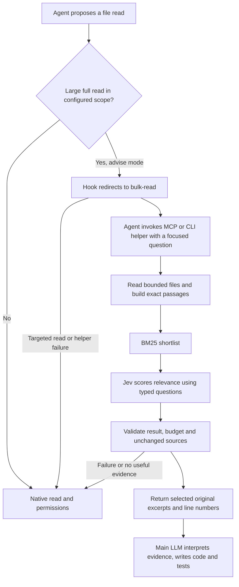

# Shunt architecture and Jevra

> Current correction contracts (2026-09-18): see [focused reader and corrected decisions](focused-reader.md). Fixed artifact packets now share route/support; economic routing defaults to narrow membership and code-owned eligibility. Dated diagrams/diagnostics below remain scoped to their recorded version.

Jevra follows the hook → helper → compact evidence → main-agent flow of [Spotify shunt](https://github.com/spotify/portal-ai-plugins/tree/3c24ca30ff63e1f5bbad1c43fe5324daff579123/plugins/shunt), reviewed at commit `3c24ca30ff63e1f5bbad1c43fe5324daff579123`. It is an original implementation, not a vendored copy or an AiKA dependency.

| Shunt responsibility | Jevra implementation | Boundary |
| --- | --- | --- |
| Intercept full reads above 350 lines | `PreToolUse` handles `Read` and simple `Bash`/Codex shell reads | User-configured roots and file-size limits; unsupported shell syntax stays native |
| Leave small and targeted reads native | `{}` preserves native permission handling | `Read` offset/limit, bounded head/tail, pipes, redirections and compound commands pass through |
| Redirect the agent to a helper | Denial names the configured MCP tool or CLI command, with targeted-read recovery | A redirect does not prove the model used the helper |
| Delegate bulk reading | Host-managed MCP or CLI → bounded local chunks → BM25 shortlist → Jev Score → original excerpts | Jev selects evidence; it does not generate a summary |
| Preserve sources for verification | Exact text, source names and line ranges returned locally | Selection is partial, not a completeness guarantee |
| Delegate code-writing reference work | `code-context --spec … --reference …` selects references | The main LLM writes code, as explicitly chosen for Jevra; no auxiliary generator or target-file write |
| Skills explain when to delegate | Packaged `bulk-reader` and `code-context` skills in both hosts | Plugin discovery and hooks need native activation |
| Measure context savings | Full-task three-arm runner plus excerpt-byte diagnostics | No inherited Spotify savings claim; host and Jev usage must both count |

## Runtime flow

The deterministic comparison arm uses the same gate, files, chunks, shortlist and output format, but selects by BM25 without calling Jev. The Jev arm scores each shortlisted passage independently in one request. The runtime applies a provisional minimum Score of 1.5 on a 0–3 relevance rubric and selects at most four passages. Scores are not probabilities of task correctness.

## Intentional differences

Jev returns typed judgments, so it cannot replace a generative shunt model as a drop-in API client. The shared orchestration stays; summaries and code generation remain with the main model. Selected source excerpts may include obsolete or conflicting evidence, which the main model must interpret.

Jevra does not interpret arbitrary shell commands. Absolute shell executables, wrappers, pipelines, substitutions and compound commands are outside the simple-read gate. Oversized, inaccessible, redirected or unconfigured files also remain native. This is an optimization surface, not a filesystem or permission enforcement boundary. Native permission rules remain authoritative; pass-through does not emit an automatic permission grant.

The preferred helper transport is host-managed stdio MCP. This is a transport adaptation: the measured Codex tool-shell sandbox could not read macOS Keychain, while the native MCP process could. It uses the same retrieval implementation and keeps credentials in the API-calling process, without changing shell permissions or running a network daemon. CLI mode remains an explicit alternative; MCP mode falls back to native targeted reads when unavailable.

Only the requested files inside configured `bulkRead.roots` are eligible. There is no repository crawl or unsolicited context injection. Each helper call is independent, bounded and may incur TypeSafe usage. Repeated calls are not free and are not cached yet.

The hook itself never calls Jev or uploads source text. In observe mode it records eligible large-read metadata without blocking. The agent must actually invoke the helper for retrieval to happen. An explicit helper invocation works in observe mode too; disabled mode rejects it. This differs from the skill router, whose observe mode still evaluates eligible prompts.

## Evidence

The later [cost audit](shunt-cost-audit.md) compares these helpers with the
implemented artifact worker and the 12-cell complete-task pilot. It identifies
the missing direct artifact handoff, capability-only routing and benchmark metric
differences. Its offline failed-transport reproduction verifies that the public
benchmark can report perfect apparent savings on empty failed responses; it is
not a live AiKA evaluation or a refutation of historical successful runs.

The table above describes the original evidence-selection path. The separate
opt-in artifact profile now delegates restricted test generation to Luna under
Jev decisions, but its host still reads and writes the full returned candidate.
The recommended next contract transfers accepted bytes through a deterministic
native-permission materializer, with a compact receipt and targeted review. It is
proposed, not an available MCP apply capability.

See the [full-task protocol](../evals/full-task/protocol.md), [full-task report](../evals/reports/2026-09-17-full-task-pilot.md), and [compatibility matrix](compatibility.md). Small synthetic tasks test integration and expose regressions; they do not establish production savings or general policy completeness.

The [token-efficiency architecture plan](token-efficiency-plan.md) expands this comparison to AiKA modes, optional generative delegation, memory providers, caching and a matched evaluation design. Those extensions are proposed, not shipped capabilities.
