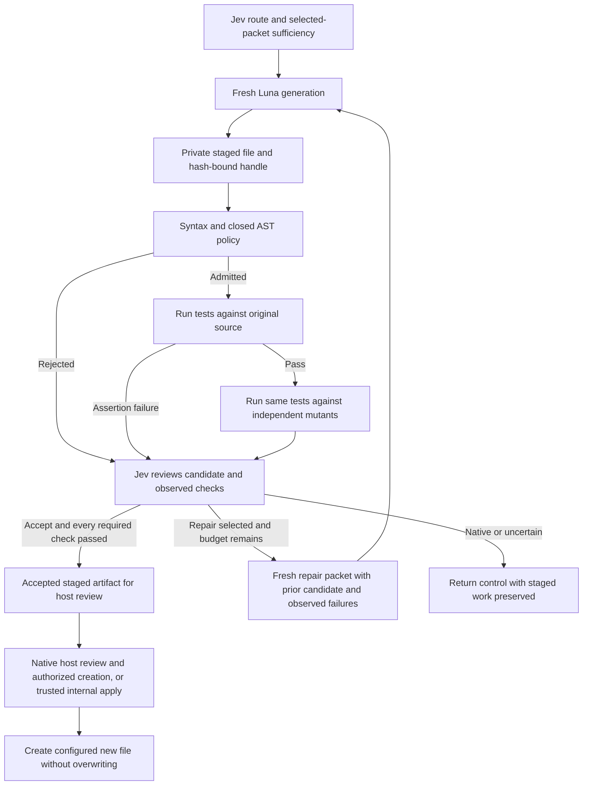

# Staged test artifacts and bounded repair

Status: internal experimental DR-023 slice, implemented on 2026-09-17. The first
live diagnostic completed generation, real checks, Jev acceptance and application
inside a synthetic fixture. [Opt-in MCP invocation](artifact-mcp.md) now delivers
artifacts for native host review; repeated ordinary adoption remains pending.

## Scope and execution boundary

`NodeTestArtifacts` provides the versioned `node-pure-function-tests/1` profile.
The runtime configures one source file, one named export, one new output filename
beside that source, a private staging directory and one to four independently
authored mutant implementations. These are trusted runtime inputs, not model
arguments. The model returns only candidate text.

The initial source grammar allows a single exported synchronous function with
one to four identifier parameters and a single return expression. That expression
may use parameters, primitive literals, selected arithmetic/comparison/logical
operators and conditionals. Imports, property access, calls and side effects are
outside this source profile.

The candidate grammar allows imports of `node:test`, `node:assert/strict` and the
configured source export, followed by one to 32 synchronous test cases. Each case
contains one to 32 direct `assert.equal`/`assert.strictEqual` assertions comparing
a call of that export with literal arguments to a literal expected value. Helpers,
loops, async code, test options, skipped tests, dynamic access and arbitrary imports
are rejected before execution. This is deliberately narrower than general Node
test generation. The grammar is a deterministic eligibility rule, not a semantic
replacement for Jev.

The runtime strips supported TypeScript syntax using the pinned Node 24.21.0 API
and checks an allowlisted AST with Acorn 8.18.0. Both original source and mutants
must satisfy the source grammar. Invalid UTF-8, oversized files, symlinks,
duplicate mutants and a mutant identical to the original are rejected.

Approved source/test pairs run as actual Node tests in disposable directories.
Each invocation uses a fixed executable and argument list, a minimal environment,
read permission only for that check directory, no write/child-process permission,
a 64 MiB V8 heap limit, bounded output, a three-second default timeout and process
group cleanup. Node's [permission model](https://nodejs.org/api/permissions.html)
is defense in depth, not a security sandbox for arbitrary JavaScript. Do not
remove the AST restrictions and present this executor as safe for arbitrary code.
The V8 heap setting is not a hard total-memory quota.

## Lifecycle

The registry is now `managed-test-worker/2`. With a validator attached, required
checks run before the semantic completion decision. Those checks are already
authorized deterministic requirements; there is no speculative model vote about
whether mandatory checks should execute. This gives Jev observed evidence when it
chooses acceptance, repair, native handoff or abstention. The older internal mode
without a validator remains available and returns `awaiting_validation` only.

One operation permits at most two generator invocations: initial generation and
one repair. Each gets a fresh Codex CLI context. A repair packet includes the
original selected sources, explicit instructions/requirements, the previous
candidate and compact observed failures. It does not contain the parent chat,
raw execution logs or mutant source implementations.

The `accept` alternative exists only when every required check passed. The
`repair` alternative disappears after the first attempt. Even when Jev selects
acceptance, every per-requirement support judgment must meet policy, all check
receipts must remain valid and the source binding must remain current. Provider
outage, uncertainty or failed mandatory checks cannot be converted into acceptance.

## What the checks establish

1. Syntax/policy admits only the bounded executable grammar.
2. The generated tests pass against the original implementation, with an observed
   test count and no failed, cancelled, skipped or pending cases.
3. Every configured mutant triggers an observed assertion failure. A timeout,
   process failure or invalid runner report is unavailable evidence, not a detected
   mutant. A mutant that passes is an effectiveness failure.
4. Jev evaluates whether the actual assertions cover the requested behavior and
   selects the next eligible action using the actual check receipts.

Mutants are supplied by the evaluator/runtime before generation. They are not
generated by the worker under evaluation, and their implementations are not sent
as repair guidance. Passing this finite set demonstrates sensitivity to those
defects; it is not proof of complete behavior coverage, independence from human
fixture-author bias or general code quality.

## Staging, freshness and application

The runtime reads bounded regular UTF-8 files without following a final symlink;
the configured source directory must be canonical. Source content, scope, output
absence and the evaluation profile are bound before generation. The source and
destination preimage are checked throughout the operation and immediately before
application. This is a local single-source profile, not a repository-wide snapshot.

Each attempt gets an opaque UUID handle with the candidate hash, byte count and
attempt number. Candidate files and compact receipts are written in a private
session directory with mode 0600. Staging writes use a temporary file followed by
rename. Failed candidates remain available for review, including when review is
uncertain or unavailable. Interrupted validation exposes an available checkpoint;
an incomplete checkpoint never authorizes continuation.

The core returns compact handles and receipts rather than echoing the file body.
`read(handle, signal)` loads a candidate after checking its handle, hash and current
source binding. Handles are owned by the runtime instance; there is no import of
caller-supplied acceptance receipts or automatic cross-process resume. Local staged
files remain on disk for inspection; retention/garbage collection is not automated.

`apply(handle, signal)` is a separate explicit runtime action. It accepts only an
accepted handle and the configured destination, which must still be absent. A
complete sibling temporary file is published with an atomic no-overwrite hard
link; an existing file or symlink causes failure. Existing files are never replaced.
The caller retains native authorization and review. General patch application,
and updates to existing files are not implemented. The MCP surface exposes no apply
method: it hands content to native tools, whose write guarantees and permissions
are separate from this internal method.
The preimage checks do not provide filesystem transactions against an adversarial
same-user process swapping parent directories or changing source during publication.

## Budget and accounting

The validator path defaults to four Jev calls, 67 questions, 196,608 cumulative Jev
request bytes and two generator invocations. The operation timeout remains 180
seconds. The [managed operation](managed-worker.md) preserves finite packet/output
limits, cancellation, no semantic fallback and usage unknowns. Repair admission
checks whether its later review still fits the call/question budget.

Every attempt, including rejected candidates and repair, remains in the ledger.
Validation receipts carry actual check kind, exit status, test/failure counts,
duration and cleanup status, bound to the staged candidate. Raw test output is
discarded. Jev and worker usage are separate; main-host usage, actual charges and
subscription consumption remain unknown.

## Validation and remaining delivery

Sixteen artifact tests exercise actual Node execution, passing baselines, detected
and surviving mutants, incorrect expectations, unsafe syntax, source/output/hash
changes, one repair, exhausted retries, forged results, uncertain review, provider
outage, cancellation checkpoints and explicit application. Existing worker and
managed-operation tests also remain in place.

The [live report](../evals/reports/2026-09-17-test-artifact-probe.md) records one
successful synthetic operation. It is not a held-out benchmark, and live repair
quality has not been measured. The subsequent [MCP host diagnostic](../evals/reports/2026-09-17-artifact-host-probe.md)
verified artifact delivery and native application in both CLIs. Ordinary Codex
adoption was observed once; Claude ordinary completion used native tools. Retain
the DR-039 transport capability gates and measure adoption and paired economics. Broader task profiles and complete-task
economics require separate validation.
