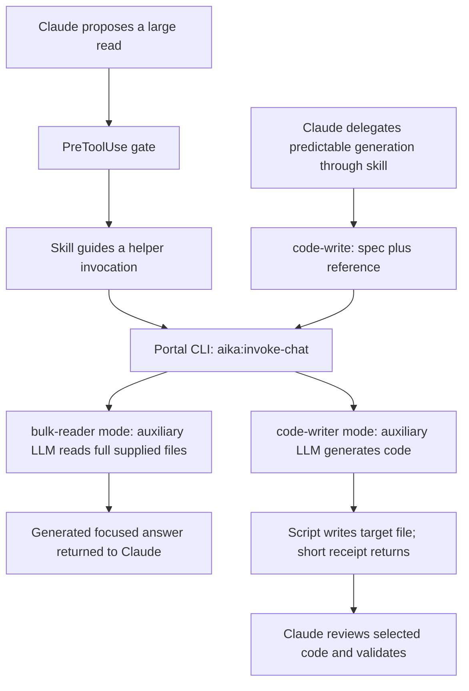
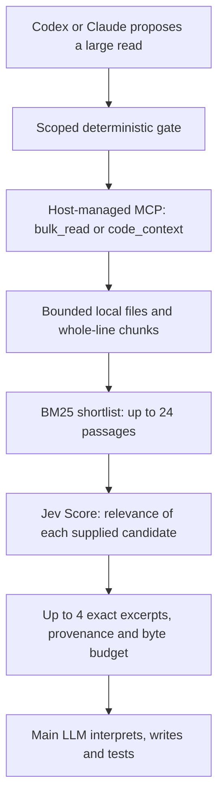
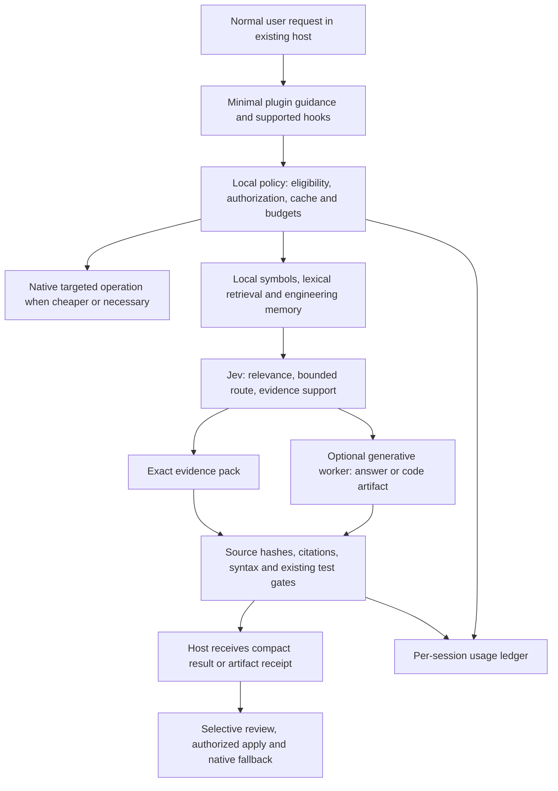

# Token efficiency: architecture review and experiment plan

> Current correction contracts (2026-09-18): see [focused reader and corrected decisions](focused-reader.md). Fixed artifact packets now share route/support; economic routing defaults to narrow membership and code-owned eligibility. Dated diagrams/diagnostics below remain scoped to their recorded version.

> Delivery update: [CLI-first worker v1](v1-delivery-plan.md) defines the adopted implementation order. The [artifact pilot](../evals/reports/2026-09-17-artifact-comparison.md) found no consistent Jev-arm savings. Compact native-ticket delivery and optional economic routing were subsequently implemented; the focused generative reader is now opt-in, while reliable economic calibration remains missing. The [2026-09-18 architecture review](shunt-architecture-review-2026-09-18.md) is the current comparison and recommends a smaller reader experiment. This document retains the earlier architecture snapshot and broader proposals; its dated gap table is not current runtime status.

Date: 2026-09-17. Status: proposal, not an implemented architecture or a savings claim.

This plan follows the owner's request to compare the complete Spotify shunt mechanism with Jevra before further implementation. The shipped choice remains **Jev selects evidence; the main LLM generates code**. The owner subsequently adopted Jevra as a complete development-focused plugin with native engineering memory and optional workers. [Development-brain architecture](development-brain.md) records that scope update; the architecture below remains planned, not silently enabled.

## Recommendation

Keep Jevra an installable plugin with a reusable internal runtime. Separate four capabilities: native engineering memory, evidence retrieval, typed decisions, and optional generation. Add the cheapest deterministic improvements first; evaluate a bounded generative worker separately; use Jev for every explicit managed semantic judgment, as adopted in the [decision architecture](decision-architecture.md). Reduce redundant calls and measure the quality/cost tradeoff; no-Jev pipelines remain experimental controls. An external memory service remains optional; native memory is core to the expanded product, although it is not required to reproduce shunt's two helper mechanisms.

The objective is fewer expensive host tokens and lower **total cost per accepted task**, subject to preserved quality. Report all-provider token use separately: moving work to a cheaper model can lower cost while increasing aggregate tokens. Subscription quota and actual charges remain unknown unless independently observable.

## Evidence and scope

- Jevra runtime reviewed at `438bd85f7f243ac23667a9c207e6c36858172971`; documentation baseline `b7fda4d9dd5a13f144f6afa8f26447650e7b6c13`.
- Spotify source pinned to `3c24ca30ff63e1f5bbad1c43fe5324daff579123`; SSH remote HEAD matched on 2026-09-17. [Repository](https://github.com/spotify/portal-ai-plugins/tree/3c24ca30ff63e1f5bbad1c43fe5324daff579123).
- The [Spotify article](https://portal.spotify.com/blog/portal-by-spotify-cut-my-claude-code-token-usage-by-90), updated September 8, uses Gemini 2.5 Flash in its two examples. That is not an immutable model requirement of the plugin or evidence of the model used in every deployment.
- [AiKA Modes documentation](https://backstage.spotify.com/docs/portal/core-features-and-plugins/aika/modes) describes a larger platform than the two shunt helpers. Optional platform processors are not proven active in the published shunt benchmark.
- [TypeSafe System One](https://docs.typesafe.ai/concepts/system-one), [building guide](https://docs.typesafe.ai/concepts/how-to-build-with-system-one), [reranking](https://docs.typesafe.ai/cookbooks/rerank_typesafe), [citation checks](https://docs.typesafe.ai/cookbooks/citation_check), and [models](https://docs.typesafe.ai/models) reviewed live on 2026-09-17.
- No authenticated AiKA run or new provider benchmark was performed for this architecture review. Proposed modules require independent implementation and evaluation.

## Current architectures

### Spotify shunt

The two paths are separate calls, each to its named mode; the diagram's common Portal node is transport, not a call to both modes. The [bulk helper](https://github.com/spotify/portal-ai-plugins/blob/3c24ca30ff63e1f5bbad1c43fe5324daff579123/plugins/shunt/scripts/bulk-read) sends the supplied corpus to a generative worker. The [writer](https://github.com/spotify/portal-ai-plugins/blob/3c24ca30ff63e1f5bbad1c43fe5324daff579123/plugins/shunt/scripts/code-write) can keep generated code out of the main context by writing it to disk. Its [skill](https://github.com/spotify/portal-ai-plugins/blob/3c24ca30ff63e1f5bbad1c43fe5324daff579123/plugins/shunt/skills/code-writer/SKILL.md) still asks the main agent to review output. This is delegated generation, not proof that arbitrary development is safely autonomous.

The read gate uses a 350-line default. Targeted reads remain allowed; code writing has advisory skill guidance, no equivalent enforcement hook. Calls are independent and resend their inputs; no client cache or session memory is present in the reviewed shunt helpers. Backend prompt caching is unknown. Shunt currently targets Claude Code; the broader Portal plugin also supports other hosts.

### Jevra alpha.2

The gate itself makes no Jev call. An actual helper invocation is required. File defaults are 64 KiB each / 128 KiB total, output 8,000 bytes, and 5-second helper deadline (8 seconds in the pilot). Oversized or unsupported reads pass through; limits are not a repository index. Jev can only rank candidates supplied by retrieval. The separate skill router recommends a skill; it does not remove the host's existing skill catalog or guarantee lower prompt tokens.

## Capability and gap map — earlier runtime snapshot

| Mechanism | Shunt / AiKA boundary | Jevra today | Next action |
| --- | --- | --- | --- |
| Large-read gate + helper + skills | Implemented in shunt | Implemented in two host adapters; ordinary plugin lifecycle pending | Finish DR-018 / DR-012 |
| Focused generative answer | Auxiliary LLM compresses supplied files | Original excerpts only | Optional DR-022 |
| Output-heavy code offload | Worker generates, script can write target | Main model generates all code | Optional DR-023; preserve current mode |
| Code-context references | One reference required by writer | Bounded multiple references supported | Improve structural coverage in DR-021 |
| Multi-file and diff intent | Bulk-reader skill suggests it; hooks are simpler | Explicit files; no dedicated diff/log processor | DR-021 / DR-024 |
| Named reusable worker configuration | AiKA modes, model/tool/processor configuration | No generator registry | Minimal versioned mode files, DR-022; no hosted platform needed |
| RAG over organization knowledge | AiKA platform capability, not established as cause of shunt benchmark | No brain adapter | Optional DR-026; isolate its contribution |
| Classification / answer verification | Optional AiKA mode processors, each may add inference | Skill Choice/Noul and evidence Score only | Narrow Jev judgments, DR-025 |
| Planning / answer formatting / history compression | Optional AiKA platform processors | No worker conversation management | Keep bounded calls; defer generative planning/history machinery |
| Cache / content-change invalidation / duplicate suppression | No application cache in reviewed shunt helpers | Not implemented; source freshness checks exist | DR-009 + DR-024 |
| Avoid repeated host reads | Targeted rereads explicitly allowed | Rereads observed in pilot | Evidence receipts, progressive disclosure, DR-021 / DR-024 |
| Total-cost controller / circuit breaker | No complete-task controller in shunt source | Per-call limits only | DR-020 / DR-025 |
| Quality + all-provider accounting | Published context proxy, not a complete-task cost experiment | Small complete-task pilot | DR-019 / DR-027 |

Do not ascribe proposed caching, AST retrieval, session budgets, or calibrated Jev routing to Spotify's implementation. They are candidate improvements beyond its reviewed client. Reusing Apache-2.0 source later requires preserving the applicable license and notices; this plan copies no implementation.

## What the benchmarks establish

Spotify reports 33,684 → 5,737, 75,990 → 4,148, and 16,221 → 821 estimated main-context tokens for three read scenarios. Its README labels these 82%, 94%, and 94%, with a rounded mean of 90%. Recomputing the displayed counts gives about 83.0%, 94.5%, and 94.9%; retain the original labels when quoting the claim rather than suggesting a new experiment.

The public [benchmark definition](https://github.com/spotify/portal-ai-plugins/blob/3c24ca30ff63e1f5bbad1c43fe5324daff579123/plugins/shunt/evals/benchmarks.json) uses characters/4. The [runner](https://github.com/spotify/portal-ai-plugins/blob/3c24ca30ff63e1f5bbad1c43fe5324daff579123/plugins/shunt/evals/run.sh) compares raw corpus with helper text. Its generation case weights output by 5 and sets the delegated main-context estimate to zero; that is a proxy, not measured zero task usage. It also tolerates helper failures with `|| true`, so a new reproduction must reject failed/empty outputs rather than counting them as savings. The public TypeScript fixtures differ from the reported Java monorepo workload. The public files do not reproduce that historical workload by themselves.

Jevra's [frozen pilot](../evals/reports/2026-09-17-full-task-pilot.md) finished: 12 runs, 2 distinct synthetic tasks, 1 repetition, 3 arms, 2 hosts; 300 external checks passed. These are not 12 independent task types.

| Host | Native input/output | Jev input/output | Estimated native cost | Estimated Jev total cost | Reading |
| --- | --- | --- | --- | --- | --- |
| Codex | 244,720 / 8,414 | 331,512 / 8,385 | $0.999356–1.092116 | $1.06468311–1.15170311 | +35.5% input; +5.5–6.5% cost under matched price assumptions |
| Claude Code | 605,579 / 21,106 | 701,240 / 19,950 | $0.577588 | $0.54302901 | +15.8% input; about −6.0% estimated cost |

The host input counts include cached input across turns, not one context window. Codex's independent cost bounds are wider than matched-scenario comparisons. Claude used Jev in only one of its two Jev-arm tasks; savings cannot be attributed confidently to the selector. The three actual Jev calls cost about $0.000973 at list prices. Actual bills and subscription quota effects are unknown. A separate helper smoke reduced source bytes by 95.1%; that was neither a full task nor a generative-summary equivalence test.

## Proposed target architecture

This is a proposal. All managed semantic choices use the Jev registry; exact operations remain deterministic. Native fallbacks are labeled bypasses when they leave the managed lifecycle. Hooks act at supported boundaries; they do not intercept hidden reasoning, replace the main model, erase previous context, or automatically execute every helper. A host-managed MCP process is not a license to bypass the host's filesystem or command permissions.

### Two product profiles

- **Evidence profile (existing commitment):** main model writes code; deterministic candidate retrieval + Jev semantic selection + caching/progressive reads aim to reduce input and retries. No auxiliary generation API is required.
- **Delegation profile (adopted direction, planned opt-in):** a user-configured generative worker summarizes or produces predictable artifacts; Jev selects references, routes eligible cases and evaluates evidence support. This restores the main missing shunt mechanism. It introduces another provider's cost, latency, data boundary and failure modes.

Native engineering memory can serve either profile. It supplies versioned knowledge; it does not become a code generator merely because it is called a brain. Keep the plugin portable: an optional private organization adapter must not become an open-source installation requirement. The first native store and capture policy are specified separately in [development-brain.md](development-brain.md).

### Internal contracts to design, not implement yet

- `EvidenceProvider.search(query, scope, budget)` → bounded candidate IDs, revisions, provenance and warnings; `read(ids, revisions)` fetches exact authorized bodies. Adapters perform authorization before retrieval and again before cache reuse. No implicit widening from a project setting to record-level authorization.
- `WorkerMode` → versioned ID, task kind, provider/model, instruction hash, allowed inputs, output schema, maximum output, deadline, repair limit, optional tool allowlist. Start with tools disabled. Do not introduce a generic self-directed agent loop for two simple helpers.
- `EvidencePack` → original spans, exact file/hash/line references, excluded/unknown coverage, next-read handles, observed usage. An assessment of sufficiency is advisory and cannot certify unseen files.
- `ArtifactReceipt` → staged path, content hash, source revisions, compact diff metadata, validators run, failures, usage and requested next review. Full output is not automatically echoed into the host context. Applying changes uses an authorized host/workspace path, preimage checks and atomic writes; it cannot overwrite arbitrary files from an unconstrained model path.
- `SessionBudget` → observed plus reserved provider usage, bounded calls, retry/fallback ledger and stop condition. Cost forecasts are estimates; unavailable host usage remains unknown. Receipt delivery is not evidence that the model understood it.

### Where Jev adds a testable hypothesis

| Judgment | Primitive / state | Experimental control and outcome policy |
| --- | --- | --- |
| Which retrieved passages help this subtask? | Score per supplied passage; focused question + original evidence | Same shortlist and output budget, lexical ranking; native expansion if coverage is missing |
| Which eligible execution path fits? | Choice over `native`, `evidence`, `summary`, `artifact`; task intent, capabilities and cost estimates | Deterministic eligibility first; native when no candidate is safe or sufficiently supported |
| Does a generated claim have source support? | Choice: supported / contradicted / insufficient; claim + exact source | First check citation existence/hash in code; expand or escalate; never treat model approval as truth |
| Is required evidence absent? | Separate bounded coverage judgments against explicit requirements and retrieved sources | Do not infer completeness of an unseen repository; ask for a targeted read |

Batch independent questions only when they share useful state; dependent retrieval needs a later call. Version question meaning, criteria and model. Calibrate thresholds on held-out data. All target managed semantic stages use Jev; no-Jev rows are controls. Jev does not write summaries, code, investigation plans or tests; it does not replace a compiler or grant permissions. LLMs also reason and decide: this is a division of suitable work, not a claim that they only emit prose.

## Ordered delivery plan

All items below are planned. They extend existing issue IDs without claiming GitHub issues were created.

This table preserves the cost-optimization workstream. The expanded product sequence adds DR-028–033 and brings a minimal native memory slice forward; see [the development-brain sequence](development-brain.md#delivery-sequence-and-first-complete-slice). External memory in phase 4 is not a substitute for that native store.

| Phase | Work and issue mapping | Exit evidence |
| --- | --- | --- |
| 0. Establish observability and ownership | DR-034 + DR-020 + existing DR-018/012: normal plugin activation, minimal tool/skill overhead, redirect → call → result → reread chain | Both hosts execute an ordinary task with attributable usage; missing data remains explicit |
| 1. Improve evidence economics | DR-021 + DR-024 + DR-009: structural chunks, coverage-aware expansion, exact caches and compact receipts | Same required-evidence recall with fewer host tokens than lexical and current Jev controls; stale/deleted evidence never reused |
| 2. Restore generative shunt mechanisms | DR-022, then DR-023: worker abstraction, bounded summary, predictable artifact generation | Verified nonempty answers, supported claims, correct artifacts, cheaper accepted tasks including worker and repairs |
| 3. Add semantic economics | DR-025 + DR-015: Jev route/support judgments and budget policy | Incremental benefit versus the identical worker pipeline without Jev; no safety gate delegated to model confidence |
| 4. Connect memory when useful | DR-026: optional read-only memory adapter and freshness-aware packs | Reduced rediscovery on repeated-project tasks with authoritative revisions and preserved access boundaries |
| 5. Confirm and ship | DR-027 + DR-019/013: frozen comparative study and per-host rollout | Predeclared quality/cost/latency gates passed on held-out complete tasks |

Do not build a Portal clone, mode-sharing SaaS, or a general framework first. Declarative local mode files and adapter interfaces cover the initial need. Revisit DR-017 after validated consumers exist. Memory write automation, semantic caches and conversation compaction are later experiments: they can add stale context, loss and inference cost.

## Economic admission and stopping rule

For any candidate delegation, estimate the host work avoided and compare it with all additional work:

`expected_net_saving = avoided_host_cost - worker_cost - jev_cost - added_host_overhead - expected_review_and_repair_cost - allocated_infrastructure_cost`

Use separate uncached input, cache-read, cache-write and output prices. Provider-specific token counts are not interchangeable units of compute. A large file already in cached context may be cheap to reuse; a hook denial and an extra tool turn may cost more than a small read. Use deterministic eligibility and exact cache reuse to avoid unnecessary inference. If a semantic route choice is needed, Jev owns it; an economic heuristic cannot silently replace that judge. Unavailable or unaffordable judgments suspend the dependent managed transition, with native continuation recorded as a bypass.

Cache by workspace/access scope, source revision/hash, exact question, mode/question version, model, output budget and relevant configuration. Deduplicate concurrent identical calls; invalidate on source edits, withdrawals and permission changes. Never mark evidence as safely remembered forever after a compacted host session. A hash receipt saves bandwidth only if the current host can use the referenced evidence.

## Evaluation that can support a superiority claim

1. **Read-operation study:** public, frozen source/reference corpus; shunt-equivalent inputs and tokenizer/proxy; check answer coverage and citations. Report context-body reduction separately from worker usage. Include broad and cross-file questions, not only short needles in long files.
2. **Whole-task study:** start with 8 reviewed tasks × 2 hosts × 4 arms × 1 repetition = 64 screening runs, in budgeted batches. This screens implementations; it is not confirmatory evidence. Freeze a later 24 independent task set × 2 hosts × 4 arms × 2 repetitions = 384 runs only after screening and a prospective variance/power/budget review. The sample size may need to change before that freeze; tasks, not repetitions, are the independent unit.
3. **Arms:** A native; B deterministic evidence/caching; C same runtime with bounded auxiliary generator and deterministic routing (shunt-style control); D C plus Jev. Retain the current Jev evidence profile as a separately labeled ablation where useful. Compare C→D to isolate Jev. Full-corpus worker versus selected-corpus worker is another bounded ablation; do not change multiple factors and attribute all gains to Jev.
4. **Spotify control:** if authenticated AiKA is available, include the pinned actual shunt plugin on Claude as an additional arm. Without it, call C a shunt-style reproduction, never Spotify's actual service. No direct Codex shunt arm is established by the reviewed source.
5. **Task families:** large-file questions, cross-file behavior, tests/config generation, exact edits/debugging where delegation should abstain, missing/conflicting evidence, and repeated project memory questions. Independent acceptance tests and reviewer labels must live outside the agent's writable task checkout; Jev must not grade itself.
6. **Receipts:** host/model/effort/plugin versions, mode and source hashes, accepted/failed/interrupted outcomes, cumulative input/cache/output per provider, usage uncertainty, latency, helper adoption, repeated reads, review/repair cost, repeated model calls and tool-catalog overhead. Unknown usage is never zero; failed tasks remain in the denominator and cost ledger.
7. **Proposed confirmatory gate, freeze before results:** task success at least 95%; paired success difference versus native and C with 95% lower confidence bound above −5 percentage points; no critical regression; aggregate cost per accepted task (including failed-attempt spend) at least 20% below native and 10% below C, with paired task-clustered 95% intervals excluding zero savings; p95 latency no more than 15% worse. These are product targets, not outcomes or a guarantee the proposed sample has enough power.
8. **Claim rules:** beating the rounded 90% context claim requires comparable corpus, questions, coverage and denominator. Beating full-task cost requires an actual matched shunt arm or an explicitly labeled shunt-style control. Publish per-host results and negative/inconclusive outcomes. Do not optimize a tiny returned answer at the expense of correctness or hidden rereads.

The expanded workflow also adopts incremental source knowledge, bounded project profiles, assumption receipts and review lessons. [Decision architecture](decision-architecture.md) maps these to DR-034–038 and defines measured decision coverage.

## Next concrete implementation slice

Start with DR-034 for the minimum Jev registry/receipt contract and DR-020/018 for normal native plugin activation and attributable usage, alongside the DR-028 memory contracts. Then deliver the minimal DR-029/030 memory slice: an explicit technical decision recalled in a fresh other-host session, with changed-source invalidation. DR-021 improves retrieval next. Optional workers are now part of the adopted product direction, but remain unimplemented and separately evaluated.
