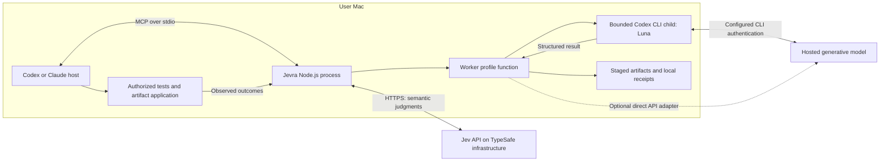
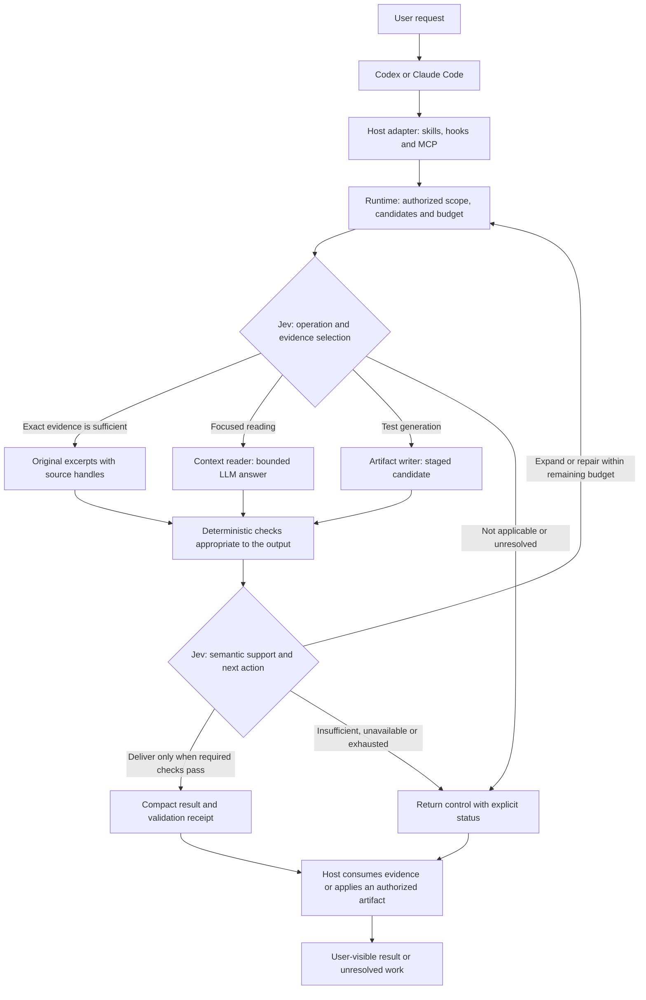

# Bounded workers: CLI-first v1 architecture

> Current correction contracts (2026-09-18): see [focused reader and corrected decisions](focused-reader.md). Fixed artifact packets now share route/support; economic routing defaults to narrow membership and code-owned eligibility. Dated diagrams/diagnostics below remain scoped to their recorded version.

Date: 2026-09-17. Status: transport, internal Jev-managed generation/ledger and a
restricted staged-test lifecycle and opt-in MCP implemented; repeated ordinary host adoption and broad evaluation remain pending.
Luna through Codex CLI is the first evaluation candidate, not a validated runtime
default. The [v1 delivery plan](v1-delivery-plan.md) defines the implementation order
and release boundaries. No new efficiency result is claimed.

This proposal narrows the delivery sequence in the [architecture critique](architecture-critique.md).
It retains the [Jev decision ownership policy](decision-architecture.md) and the
long-term [development brain direction](development-brain.md), while making the
first worker experiment independent of Spotify Portal and AiKA.

## Implemented transport boundary

DR-039 now includes an internal versioned request/result contract, a bounded POSIX
subprocess runner and a Codex CLI generator. See the [probe report](../evals/reports/2026-09-17-cli-worker-probe.md).
The MCP server still exposes only evidence tools; no generator is installed into
normal host sessions. A generated candidate is not validated, applied or approved.

The first adapter supports the inspected Codex version, forces the configured
OpenAI/ChatGPT path, checks CLI login status and strips inherited API credential
overrides and agent environment state. It preserves the original auth location,
without copying tokens or changing global settings. It creates a private temporary
workspace, passes a fresh packet through stdin, supplies a short generator instruction
file and JSON output schema, and cleans up its temporary files after execution.

Project-document auto-loading, automatic skill instructions, memory, plugins, apps,
shell/browser/agent capabilities and web search are disabled for this profile;
MCP configuration is explicitly empty. Required project/user instructions must be
supplied in the packet by the orchestrator. Administrative policy remains
under CLI authority. A standalone user `hooks.json` is currently unsupported and
causes refusal before inference, rather than modifying or executing it.

Default bounds are 48 KiB of explicit input, 1 MiB of stdout events, 32 KiB of
stderr, 64 KiB of candidate content and 120 seconds for preflight plus generation.
Process termination adds a 250 ms grace period and at most one second of cleanup
observation. One transport instance accepts one active operation and one generation
invocation per call. The [managed operation](managed-worker.md) enforces expiry,
decision receipts and usage accounting. Without a validator it allows one
generation; the [artifact profile](test-artifacts.md) permits a second generation
only after Jev selects repair. The transport alone does not enforce that lifetime budget.

The final local probe returned the exact candidate in 5.118 seconds, with 2,512
input and 22 output tokens and no tool items observed. This establishes a working
transport on that setup, not absence of all possible tools, general model quality,
task-level savings or ordinary plugin adoption. Broader capability certification
remains open. Actual billing and subscription allowance consumption remain unknown.

## What a worker means

A worker is a bounded operation profile: input/output contracts, evidence,
instructions, an executor and limits. Depending on its job, the executor combines
ordinary code, Jev judgments and optional LLM generation. A worker does not always
require a generative model or a separate operating-system process. It is not a
permanent autonomous agent with its own conversation history. Multiple generative
profiles can use the same model. Start with one configured generative provider
and a small fixed model configuration; model selection experiments can follow.

Jev evaluates explicit semantic choices inside Jevra-managed workers, including
review and investigation. Generative steps produce answers, artifacts, hypotheses,
or candidate findings only when necessary. The runtime owns
exact retrieval, validation, budgets and execution. Native host authority remains
in force; no worker inherits unrestricted shell access or file-write permissions.

## Worker inventory

| Profile | Bounded input | Output | Initial status |
| --- | --- | --- | --- |
| `artifact-writer` / `tests` | Explicit behavior requirements, implementation evidence, test conventions, authorized target | Candidate test artifact staged outside the working source tree | First complete experiment |
| `context-reader` | Focused question and Jev-selected source evidence with exact source handles | Concise answer with citations, limitations and unresolved gaps | Follow-on profile after the first artifact path is measured |
| `artifact-writer` / `repair` | Existing candidate, specific findings, actual check failures and attempt history | A corrected candidate artifact | Reuses the writer; at most one repair attempt in the initial experiment |
| `artifact-writer` / `fixtures`, `configuration`, `repetitive-code` | A precise specification and applicable examples | Candidate artifact matching the supplied conventions | Expand only after the tests profile is measured |
| `change-reviewer` | Relevant diff, explicit review criteria, requirements, current source and check results | Jev judgments about supplied requirements/findings; optional LLM-generated candidate findings | Later as a broader worker; a narrow Jev requirement check belongs in the first generation experiment |
| `investigator` | Reproduction, failure evidence, source and candidate hypotheses/checks | Jev selection of supported hypotheses and the next check; optional LLM-generated new hypotheses | Later; execution stays with authorized tools |

The reviewer's generative step does not approve changes; Jev evaluates semantic
criteria, and deterministic policy preserves required checks and authority. The
investigator's LLM step does not choose the next action; Jev selects among eligible
actions and authorized tools execute it. Repair is a mode of the writer, not
another model conversation. No planner, memory compiler, documentation writer or
general agent swarm is a prerequisite to this experiment.

### Review and investigation without a generative call

Known review criteria can go directly to Jev with the actual diff and source:
for example, whether a specific requirement is supported, contradicted or still
unresolved. Findings already supplied by static analyzers or prior checks can
also be evaluated directly. Runtime templates can render the resulting typed
judgments without asking an LLM to write an explanation. This is not proof that
an unrestricted review found every possible defect.

An investigation with existing candidate causes and tests can use only code,
Jev and authorized tools. Jev compares candidates against observations and selects
the next diagnostic action. If none fits, preserve that outcome. An optional LLM
step can propose previously unrepresented hypotheses or synthesize a reproduction;
Jev then evaluates those candidates. Code can also derive candidates from logs,
symbols and known failure patterns. Do not require an LLM to prepare every Jev call.

These are proposed applications of typed judgments, not benchmark evidence that
Jev has already matched a general-purpose coding reviewer or debugger.

## Initial model recommendation

Consulted official model pages on 2026-09-17. These are evaluation candidates,
not installed defaults or claims of relative correctness on Jevra tasks.

| Role | Candidate | Standard input / output USD per million tokens |
| --- | --- | --- |
| Explicit semantic decisions, including review and investigation | Existing Jev provider, with the model version recorded | Capture actual TypeSafe usage independently |
| First test-generation and bounded repair experiment | `gpt-5.6-luna` | $0.20 / $1.20 |
| Optional comparison if the first candidate misses quality requirements | `gpt-5.4-mini` | $0.75 / $4.50 |

Luna is the preferred first candidate, incorporating the user's favorable prior
experience and its lower published API rates. Its standard input and output rates
are approximately 73.3% lower than mini's; this is a unit-price comparison, not a
measured reduction in complete-task cost or subscription consumption. Prior user
observations are a useful starting signal, not a controlled Jevra benchmark or a
claim of general superiority. Compare total usage and independent quality before
promotion. A failed quality gate need not mean a more expensive model is needed:
first distinguish model failures from missing evidence or an inadequate contract.

Rates above exclude cache discounts/write charges, batch discounts and tool fees.
Luna requests above 272K input tokens have different pricing; the proposed worker
inputs are bounded well below that size. Record reasoning usage where billed.

### Model and transport are separate choices

Use the Codex CLI transport for the first local experiment. The transport has a
successful synthetic probe. The [MCP artifact surface](artifact-mcp.md) can now be
enabled explicitly for configured profiles; it remains disabled by default.
The main host can be either Codex or Claude Code: a local Jevra process can launch
a separately authenticated Codex CLI child configured with Luna.

| Transport adapter | Initial role | Authentication and accounting |
| --- | --- | --- |
| `codex-cli` | Preferred experiment: noninteractive `codex exec` with `gpt-5.6-luna` | Official CLI authentication; ChatGPT subscription allowance when signed in that way, or separate API billing when explicitly configured that way |
| `claude-cli` | Optional alternative using a configured Claude model | Official `claude -p` authentication; subscription limits or API billing according to the active authentication path |
| `provider-api` | Optional direct generation adapter for environments where separate API billing is preferred | Explicit provider credentials and usage-based API billing |

On 2026-09-17, local inspection confirmed Codex CLI `0.154.0-alpha.6.2`, a
ChatGPT login, and `gpt-5.6-luna` listed in the local model catalog. Claude CLI
`2.1.274` exposes noninteractive operation. These checks establish local
prerequisites; the subsequent probe above verifies one transport invocation, not a
complete development worker. Model availability must also be
checked at execution time; do not silently substitute another model or transport.

Using an existing subscription can reduce incremental cash spending while there
is available allowance. It does not make tokens free or establish token savings:
worker usage competes with normal usage, limits depend on the plan and workload,
and credits or extra usage can incur additional charges. Keep subscription fees,
incremental charges, observable quota consumption and API-equivalent estimates
separate. A reported model cost estimate is not proof of a charge on the bill.

Use the official CLI's supported authentication; do not extract its login tokens
and reuse them in direct API requests. Prevent unintended credential overrides,
such as an inherited API key selecting API billing. Do not silently fall back to
a paid API or purchase additional allowance when a CLI limit is reached.

The currently published Claude subscription notice says the announced Agent SDK
billing changes were paused: `claude -p` continues to draw from subscription
usage limits when using that authentication. Recheck provider documentation when
implementing and record the observed authentication mode for each run.

A CLI brings an agent runtime as well as a model. It may load instructions,
plugins, MCP tools and history that add tokens or reenter Jevra. The adapter must
use fresh bounded input, scope inherited configuration, prevent recursive worker
dispatch and restrict tools to the operation's contract. Validate these controls
for the installed CLI version. In particular, Claude's local `--bare` mode skips
OAuth authentication and is unsuitable for this subscription experiment.

Jev still selects the managed operation, evidence and semantic continuation.
CLI-internal reasoning and any tool choices left available to its agent are not
automatically Jev-controlled. Start with a generator that returns a candidate
artifact; keep investigation loops, testing and final application in the explicitly
authorized runtime/host flow. Evaluate startup and harness overhead on full tasks.

### Fresh request execution contract

Use a new noninteractive invocation for every generation attempt. A new invocation
does not require the main conversation history: Jevra constructs the input packet
and sends it through stdin. Never use resume/continue/fork for this profile. A repair
is another fresh call with the specific candidate, failures and relevant evidence.
The runtime retains bounded operation state, not a model conversation transcript.

Distinguish three independent properties:

| Property | Required behavior |
| --- | --- |
| Conversation history | Do not inherit or resume the parent/previous worker conversation |
| Local session persistence | Use the CLI's ephemeral/no-session-persistence option; retain only Jevra-owned bounded artifacts and receipts by default |
| Automatically loaded context and capabilities | Explicitly control discovered instructions, memory, plugins, MCP, hooks and tools; ephemeral mode alone does not remove these |

Illustrative Codex command using options present in the inspected local version;
`task.txt` represents a prepared input packet, not a repository file supplied here:

```sh
codex exec \
  --model gpt-5.6-luna \
  --ephemeral \
  --ignore-user-config \
  --sandbox read-only \
  --json \
  - < task.txt
```

This is a starting invocation, not the completed isolation implementation.
`--ignore-user-config` skips the user's config file while retaining CLI auth; it
does not establish that all instruction/skill discovery or tools are disabled.
The adapter must use a controlled working scope, verify remaining capabilities and
preserve applicable mandatory instructions in the explicit packet. Do not disable
organizational policy or permissions to reduce prompt size. Read-only is not a
guarantee of no file reads, no tools or no extra inference turns.

The optional Claude adapter has a more explicit minimal invocation on the inspected
version. The model must also be configured and recorded before an evaluation:

```sh
claude -p \
  --safe-mode \
  --tools "" \
  --no-session-persistence \
  --system-prompt "Generate the requested artifact using only the supplied context." \
  --output-format json \
  < task.txt
```

Safe mode suppresses customizations while retaining normal authentication and
permissions; managed policy remains applicable. The custom instruction above is
illustrative: the production packet includes the actual requirements, constraints
and output contract. `--tools ""` disables built-in tools; the adapter must also
verify that no MCP tools are exposed. Do not substitute `--bare` when subscription
OAuth is required. These examples were checked against CLI help/documentation;
the Codex example is a starting illustration, while the implementation now applies
the fuller bounded profile described above. The Claude adapter remains unimplemented.

The implementation launches an executable with an argument array and stdin, without
shell interpolation. It bounds input, output, time and attempts, parses structured
events, and kills the child process tree on cancellation. One process invocation
does not guarantee one underlying model request or zero system-prompt overhead.
Test actual behavior rather than equating these flags with a raw API request.

## Where execution happens

The existing MCP entry point in `packages/cli/src/mcp.ts` is a local Node.js
process using stdio. It currently exposes evidence tools; the generation and
review profiles in this proposal do not exist yet.

For the proposed CLI-first worker transport:

1. The host starts/connects to the local Jevra MCP process through its plugin
   configuration. No network-listening service or deployment is required.
2. Skills advertise an operation. A supported hook may redirect an eligible tool
   attempt; the host actually invokes an MCP tool. Automatic adoption must still
   be measured and cannot be inferred from a hook firing.
3. The tool handler runs a worker profile in the local process: validate arguments,
   gather authorized source and call Jev. If generation is needed, the selected
   transport starts a bounded noninteractive local CLI child process.
4. The child sends the supplied prompt through its configured provider connection;
   model inference happens on provider infrastructure. Jev inference happens on
   TypeSafe infrastructure. The CLI itself runs locally and its available tools
   could access local files, so constrain its tools, working scope and permissions.
5. Candidate artifacts, source cache and minimal receipts stay on the user's Mac.
   The runtime parses the child's structured result and stages the candidate.
6. Initially, test commands and final application use the host's authorized tools.
   Feed actual results into a continuation check. A future isolated executor must
   explicitly enforce equivalent scope and permissions: stdio MCP does not itself
   inherit a shell sandbox or grant command-execution authority.

The direct API adapter replaces steps 3–5 with a provider request and response;
the same worker contract, Jev decision policy and artifact checks still apply.
Launching a CLI does not require a separate visible chat or a cloud deployment.

Conceptual tool call, not an implemented public API:

```json
{
  "tool": "generate_artifact",
  "arguments": {
    "profile": "tests",
    "spec": "Cover retry limits and permanent failures without real network requests.",
    "references": ["src/retry.ts", "tests/existing.test.ts"],
    "target": "tests/retry.test.ts"
  }
}
```

The local handler applies configured bounds rather than trusting caller-provided
budgets or paths. Its output identifies the staged artifact and pending checks;
it cannot report passed tests before authorized tools have actually run them.



The reader is optional even when available. Exact excerpts may be sufficient,
especially for edits. Summaries cannot replace the exact source required to apply
a patch, and the runtime must not force every request through every profile.

## Proposed flow



The diagram is a logical flow, not a required API call per node. Independent
questions over the same state can share one Jev request. Questions that depend on
retrieved evidence or worker output require that later state. Do not introduce a
host round trip between every internal step.

The native route leaves the managed operation. It must not be reported as a
Jev-controlled decision or successful worker completion. Jev unavailability cannot
silently transfer a managed semantic judgment to an LLM. Hooks cannot control the
host's internal reasoning or every choice implicit in generated code.

## Where Jev participates

| Judgment | Primitive | Required boundary |
| --- | --- | --- |
| Which eligible operation fits the supplied request? | Choice, including native/insufficient outcomes | Allowed operations and hard budget constraints are supplied by code |
| How relevant is each candidate reference to a stated requirement? | Score with defined ordered criteria | Candidate recall and selected-set coverage are evaluated separately |
| Does the supplied evidence contain the prerequisite needed for requirement X? | Noul | This only evaluates supplied evidence; it cannot establish repository-wide absence |
| Is requirement X supported, contradicted or unresolved by the candidate and observed checks? | Choice | Actual artifact and source evidence are needed; generator self-reports are insufficient |
| Which eligible next action should follow? | Choice | Deliver, expand, repair or return control, subject to mandatory checks and limits |

No model call is needed to count tokens, compare hashes, check a process exit
status, enforce a permission or calculate a budget. Jev's response does not override
those controls. Confidence is not proof of program correctness.

## Contracts and execution

- Inputs carry a task/operation ID, explicit requirements, source handles and
  hashes, relevant conventions, output contract, deadline and reserved budget.
- Send the worker only the context needed for its operation. Do not replay the
  main agent's entire conversation or precompute several full solutions by default.
- Reader outputs retain citation handles and explicit gaps. Exact citation checks
  establish provenance; Jev evaluates whether the cited evidence supports claims.
- Writer outputs are candidates. Stage and validate them in an authorized isolated
  environment. Apply only through a host-authorized path after preimage checks;
  the main model need not reproduce the entire artifact as output text.
- Required checks are invariant. A failed required check removes delivery from the
  eligible actions even if a semantic judgment is favorable. Unrun checks remain
  unknown, not passed.
- The runtime enforces a finite operation budget and, initially, one repair attempt.
  A request to exceed either returns control with the remaining findings.
- CLI adapters enforce timeouts and process cleanup, parse structured results and
  errors, constrain tool access, and block recursive worker dispatch. Record the
  actual model, CLI version and authentication mode without collecting credentials.
  Do not assume every CLI exposes a strict token cap: record enforceable bounds
  and measured usage separately, and stop dispatching when the operation is exhausted.
- Return a concise result: relevant source references or artifact location, changed
  scope, actual checks, limitations and next action. Make exact details available
  on demand rather than routinely appending all prompts, files and logs.
- Keep an operation ledger for all model usage, latency, attempts, bypass and final
  outcome. Missing usage is unknown rather than zero.

## Storage and memory

Start with source-bound exact caches and compact task receipts. Cache keys include
source revision, query, model/profile and policy versions as applicable. A content
cache hit does not substitute for a required semantic judgment. A previously valid
Jev receipt is reusable only for the exact unchanged decision state and policy.

Durable engineering memory is a follow-on capability, not a worker required on the
first path. The proposed minimum is accepted constraints, verified outcomes and
failed attempts with scope and freshness. Do not store a generated hypothesis as an
established fact or inject the full memory store into every request.

## First experiment and promotion

1. Implement the `artifact-writer/tests` profile using the existing Jev provider,
   evidence retrieval and MCP foundation, with Luna through the Codex CLI as the
   first transport candidate. Measure normal plugin adoption in Claude Code first,
   then repeat on Codex using the shared core and its own adapter. The worker
   transport is independent of which host invokes the plugin.
2. Validate generated tests against intended behavior and seeded defects. Merely
   compiling or passing on the current implementation does not demonstrate useful tests.
3. Compare native execution, identical workers with deterministic routing, and those
   workers with Jev-managed decisions. The no-Jev arm is an experimental control,
   not the production decision ownership policy.
4. Use distinct tasks, repeated trials, independent acceptance checks and separate
   cache accounting. Report task success alongside cost per accepted task, including
   failed attempts, reviews, repairs, main-host usage, workers and Jev.
5. Keep provider cost estimates separate from actual bills and subscription quota.
   Count CLI prompt/setup overhead and any internal tool turns. Unavailable quota
   telemetry remains unknown; do not infer a plan allowance from API token prices.
   Select specific worker models from measured quality/cost tradeoffs rather than
   naming a cheapest model as an architectural dependency.
6. Add the reader and subsequent profiles only with their own evidence. An extra
   reviewer, memory step or Jev call must justify its effect on complete tasks.

## References

- [Current specification](../SPEC.md): distinguishes shipped evidence selection from planned generation.
- [Current full-task pilot](../evals/reports/2026-09-17-full-task-pilot.md): no auxiliary generation arm.
- [TypeSafe workflow design](https://docs.typesafe.ai/concepts/how-to-build-with-system-one).
- [TypeSafe citation checks](https://docs.typesafe.ai/cookbooks/citation_check) and [typed function calling](https://docs.typesafe.ai/cookbooks/function_calling): concrete judgment and action-selection patterns.
- [GPT-5.4 mini](https://developers.openai.com/api/docs/models/gpt-5.4-mini) and [GPT-5.6 Luna](https://developers.openai.com/api/docs/models/gpt-5.6-luna): official candidate descriptions and pricing.
- [Codex noninteractive mode](https://learn.chatgpt.com/docs/non-interactive-mode), [authentication](https://learn.chatgpt.com/docs/auth) and [plan usage](https://learn.chatgpt.com/docs/pricing): supported CLI execution and separate subscription/API authentication paths.
- [Claude noninteractive mode](https://code.claude.com/docs/en/headless) and [current subscription usage notice](https://support.claude.com/en/articles/15036540-use-the-claude-agent-sdk-with-your-claude-plan): CLI automation and the paused billing change.
- [Claude CLI options](https://code.claude.com/docs/en/cli-reference): safe mode, tool restriction, custom system prompt and session persistence.
- [Choice](https://docs.typesafe.ai/primitives/choice), [Score](https://docs.typesafe.ai/primitives/score), [Noul](https://docs.typesafe.ai/primitives/noul).
- [Spotify Shunt](https://github.com/spotify/portal-ai-plugins/tree/3c24ca30ff63e1f5bbad1c43fe5324daff579123/plugins/shunt): public comparison for focused reading and artifact generation; Portal is not a dependency of this proposal.
